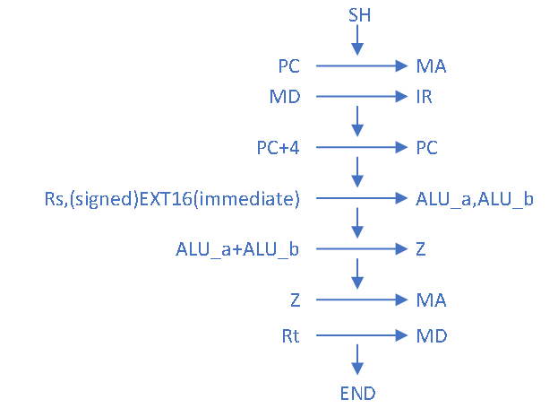

 

 

 

 

# 54条指令多周期CPU设计

学生姓名： 李洋旻 

专  业： 信息安全

2021年6月至7月

目录

[摘要	](#_Toc9376 )

[1 程序设计思路	](#_Toc5658 )

[1.1 54条指令分析	](#_Toc13126 )

[1.2 54条指令输入输出关系表	](#_Toc26404 )

[1.3 编排指令操作时间表	](#_Toc18648 )

[1.4 绘制状态转移表	](#_Toc5084 )

[1.5 绘制数据通路结构图	](#_Toc9395 )

[1.6 绘制状态转移图	](#_Toc20863 )

[2 CPU模块设计	](#_Toc4565 )

[2.1 模块构建架构	](#_Toc3728 )

[2.2 CPU各模块设计	](#_Toc26968 )

[2.2.1 Controller部件	](#_Toc1924 )

[2.2.2 Regfile部件	](#_Toc32037 )

[2.2.3 ALU部件	](#_Toc22719 )

[2.2.4 PC寄存器部件	](#_Toc18861 )

[2.2.5 EXTEND部件	](#_Toc37 )

[2.2.6 MUX部件	](#_Toc17322 )

[2.3 CPU模块测试	](#_Toc31811 )

[2.3.1 前方真测试	](#_Toc24880 )

[2.3.2 后仿真测试	](#_Toc32179 )

[2.4 CPU下板实现	](#_Toc8185 )

[3 心得体会	](#_Toc1191 )

摘要

本文实现了多周期54条指令CPU的具体实现过程，整个文章分为三大板块：第一大板块位每条指令的分析部分，包括54条指令CPU的具体设计，原理、通路、以及设计的过程；第二个板块为整个CPU部件通路图的构建，根据多周期CPU的设计理念进行多周期CPU的设计，构建每条指令的微程序流程，对于每一个状态进行细分，从而更好的控制位程序的生成。第三个板块位更具所生成的控制信号表和状态转移表进行代码的书写，从而能够更为清晰的完成整个CPU的工作流程。

通过本次54条指令CPU的学习也让我更好的了解到了CPU的内部原理和基本知识，从前方真到后仿真最终到下板的过程也逐步实现完成。详细的设计刘恒和设计结果请参考本文档中的内容部分。

关键词

多周期CPU设计，MIPS54，前仿真，后仿真，综合，下板实现

 

 

## 1 程序设计思路

### 1.1 54条指令分析

\1. ADD

l 所需操作：取指令、rd←rs+rt、PC←PC+4

l 所需部件：PC、NPC、IMEM、RegFiles、ALU

l 指令通路

l 指令流程图

\2. ADDU

l 所需操作：取指令、rd←rs+rt、PC←PC+4

l 所需部件：PC、NPC、IMEM、RegFiles、ALU

l 指令通路

l 指令流程图

\3. SUB

l 所需操作：取指令、rd←rs-rt、PC←PC+4

l 所需部件：PC、NPC、IMEM、RegFiles、ALU

l 指令通路

l 指令流程图

\4. SUBU

l 所需操作：取指令、rd←rs-rt、PC←PC+4

l 所需部件：PC、NPC、IMEM、RegFiles、ALU

l 指令通路

l 指令流程图

\5. AND

l 所需操作：取指令、rd←rs and rt、PC←PC+4

l 所需部件：PC、NPC、IMEM、RegFiles、ALU

l 指令通路

l 指令流程图

\6. OR

l 所需操作：取指令、rd←rs ot rt、PC←PC+4

l 所需部件：PC、NPC、IMEM、RegFiles、ALU

l 指令通路

l 指令流程图

\7. XOR

l 所需操作：取指令、rd←rs xor rt、PC←PC+4

l 所需部件：PC、NPC、IMEM、RegFiles、ALU

l 指令通路

l 指令流程图

\8. NOR

l 所需操作：取指令、rd←rs nor rt、PC←PC+4

l 所需部件：PC、NPC、IMEM、RegFiles、ALU

l 指令通路

l 指令流程图

\9. SLT

l 所需操作：取指令、if(rs<rt) rd=1 else rd=0、PC←PC+4

l 所需部件：PC、NPC、IMEM、RegFiles、ALU、EXT1

l 指令通路

l 指令流程图

\10. SLTU

l 所需操作：取指令、if(rs<rt) rd=1 else rd=0、PC←PC+4

l 所需部件：PC、NPC、IMEM、RegFiles、ALU、EXT1

l 输入来源表

l 指令通路

l 指令流程图

\11. SLL

l 所需操作：取指令、rd←rt<<shamt、PC←PC+4

l 所需部件：PC、NPC、IMEM、RegFiles、ALU、EXT5

l 指令通路

l 指令流程图

\12. SRL

l 所需操作：取指令、rd←rt>>shamt、PC←PC+4

l 所需部件：PC、NPC、IMEM、RegFiles、ALU、EXT5

l 指令通路

l 指令流程图

\13. SRA

l 所需操作：取指令、rd←rt>>shamt、PC←PC+4

l 所需部件：PC、NPC、IMEM、RegFiles、ALU、EXT5

l 指令通路

l 指令流程图

\14. SLLV

l 所需操作：取指令、rd←rt<<rs、PC←PC+4

l 所需部件：PC、NPC、IMEM、RegFiles、ALU

l 指令通路

l 指令流程图

\15. SRLV

l 所需操作：取指令、rd←rt>>rs、PC←PC+4

l 所需部件：PC、NPC、IMEM、RegFiles、ALU

l 指令通路

l 指令流程图

\16. SRAV

l 所需操作：取指令、rd←rt>>rs、PC←PC+4

l 所需部件：PC、NPC、IMEM、RegFiles、ALU

l 指令通路

l 指令流程图

\17. JR

l 所需操作：取指令、PC←rs

l 所需部件：PC、NPC、IMEM、RegFiles

l 指令通路

l 指令流程图

\18. ADDI

l 所需操作：取指令、rd←rs+(sign-extend)immediate、PC←PC+4

l 所需部件：PC、NPC、IMEM、RegFiles、ALU、EXT16

l 指令通路

l 指令流程图

\19. ADDIU

l 所需操作：取指令、rd←rs+(zero-extend)immediate、PC←PC+4

l 所需部件：PC、NPC、IMEM、RegFiles、ALU、EXT16

l 指令通路

l 指令流程图

\20. ANDI

l 所需操作：取指令、rd←rs and (zero-extend)immediate、PC←PC+4

l 所需部件：PC、NPC、IMEM、RegFiles、ALU、EXT16

l 指令通路

l 指令流程图

\21. ORI

l 所需操作：取指令、rd←rs or (zero-extend)immediate、PC←PC+4

l 所需部件：PC、NPC、IMEM、RegFiles、ALU、EXT16

l 指令通路

l 指令流程图

\22. XORI

l 所需操作：取指令、rd←rs xor (zero-extend)immediate、PC←PC+4

l 所需部件：PC、NPC、IMEM、RegFiles、ALU、EXT16

l 指令通路

l 指令流程图

\23. LW

l 所需操作：取指令、rt←memory[rs+(signed-extend)immediate]、PC←PC+4

l 所需部件：PC、NPC、IMEM、RegFiles、ALU、EXT16、DMEM

l 指令通路

l 指令流程图

\24. SW

l 所需操作：取指令、memory[rs+(signed-extend)immediate] ←rt、PC←PC+4

l 所需部件：PC、NPC、IMEM、RegFiles、ALU、EXT16、DMEM

l 指令通路

l 指令流程图

\25. BEQ

l 所需操作：取指令、if(rs==rt) PC←PC+4+(sign-extend)immediate<<2 else PC←PC+4

l 所需部件：PC、NPC、IMEM、RegFiles、ALU、EXT18、ADD

l 指令通路

l 指令流程图

\26. BNE

l 所需操作：取指令、if(rs!=rt) PC←PC+4+(sign-extend)immediate<<2 else PC←PC+4

l 所需部件：PC、NPC、IMEM、RegFiles、ALU、EXT18、ADD

l 指令通路

l 指令流程图

\27. SLTI

l 所需操作：取指令、if(rs< (sign-extend)immediate) rt=1 else rt=0、PC←PC+4

l 所需部件：PC、NPC、IMEM、RegFiles、ALU、EXT1、EXT16

l 指令通路

l 指令流程图

\28. SLTIU

l 所需操作：取指令、if(rs< (zero-extend)immediate) rt=1 else rt=0、PC←PC+4

l 所需部件：PC、NPC、IMEM、RegFiles、ALU、EXT1、EXT16

l 指令通路

l 指令流程图

\29. LUI

l 所需操作：取指令、rt←immediate<<16、PC←PC+4

l 所需部件：PC、NPC、IMEM、RegFiles、ALU、EXT16

l 指令通路

l 指令流程图

\30. J

l 所需操作：取指令、PC←(PC+4)[31:28],address,0,0

l 所需部件：PC、NPC、IMEM、RegFiles、II

l 指令通路

l 指令流程图

\31. JAL

l 所需操作：取指令、$31←(PC+4)、PC←(PC+4)[31:28],address,0,0

l 所需部件：PC、NPC、IMEM、RegFiles、II、ADD4

l 指令通路

l 指令流程图

\32. DIV

l 所需操作：取指令、PC←(PC+4)、(hi,lo) ←rs/rt

l 所需部件：PC、NPC、IMEM、RegFiles 、DIV、hi、lo

l 指令通路

l 指令流程图

\33. DIVU

l 所需操作：取指令、PC←(PC+4)、(hi,lo) ←rs/rt

l 所需部件：PC、NPC、IMEM、RegFiles 、DIVU、hi、lo

l 指令通路

l 指令流程图

\34. MULT

l 所需操作：取指令、PC←(PC+4)、(hi,lo) ←rs*rt

l 所需部件：PC、NPC、IMEM、RegFiles 、MULT、hi、lo

l 指令通路

l 指令流程图

\35. MULTU

l 所需操作：取指令、PC←(PC+4)、(hi,lo) ←rs*rt

l 所需部件：PC、NPC、IMEM、RegFiles 、MULTU、hi、lo

l 指令通路

l 指令流程图

\36. BGEZ

l 所需操作：取指令、if(rs>=0) PC←PC+4+(sign-extend)immediate<<2 else PC←PC+4

l 所需部件：PC、NPC、IMEM、RegFiles、ALU、EXT18、ADD

l 指令通路

l 指令流程图

l 指令解释：根据rs是否为0来进行有关跳转得决策，跳转的内容为当前PC+4的值与18位有符号拓展位数左移两位之和。

 

\37. JALR

l 所需操作：取指令、rd(31 implied) ←return_addr、pc←rs

l 所需部件：PC、NPC、IMEM、RegFiles、ALU

l 指令通路

l 指令流程图

l 指令解释：将当前（+4之后的）PC值存放在rd寄存器当中，将寄存器对应的值放在PC寄存器当中，执行对应寄存器当中的地址的指令。

 

\38. LBU

l 所需操作：取指令、PC←(PC+4)、rt←memory[base+offset]

l 所需部件：PC、NPC、IMEM、RegFiles、ALU、DMEM、CBW、EXT16

l 指令通路

l 指令流程图

l 指令解释：在内存中通过基地址和偏移量相加所得的有效地址中，取一个8bit的字节的内容，通过0扩展(无符号扩展)存入rt寄存器中。

 

\39. LHU

l 所需操作：取指令、PC←(PC+4)、rt←memory[base+offset]

l 所需部件：PC、NPC、IMEM、RegFiles、ALU、DMEM、CHW、EXT16

l 指令通路

l 指令流程图

l 指令解释：在内存中通过基地址和偏移量相加所得的有效地址对应的内存当中，取一个半字的内容，通过0扩展后存入rt寄存器中。

 

\40. LB

l 所需操作：取指令、PC←(PC+4)、rt←memory[base+offset]

l 所需部件：PC、NPC、IMEM、RegFiles、ALU、DMEM、CBW、EXT16

l 指令通路

l 指令流程图

l 指令解释：在内存中通过基地址和偏移量相加所得的有效地址对应的内存中，取一个8bit的字节，通过有符号扩展后存入rt寄存器中。

 

\41. LH

l 所需操作：取指令、PC←(PC+4)、rt←memory[base+offset]

l 所需部件：PC、NPC、IMEM、RegFiles、ALU、DMEM、CHW、EXT16

l 指令通路

l 指令流程图

l 指令解释：在内存中通过基地址和偏移量相加所得的有效地址对应的内存中，取一个半字长度的内容，通过有符号扩展后存入rt寄存器中。

 

\42. SB

l 所需操作：取指令、PC←(PC+4)、memory[base+offset]←rt

l 所需部件：PC、NPC、IMEM、RegFiles、ALU、DMEM、CBW、EXT16

l 指令通路

l 指令流程图

l 指令解释：在rt寄存器中最低8位的数据被存入到由基地址和偏移量相加所得有效地址的内存中。

 

\43. SH

l 所需操作：取指令、PC←(PC+4)、memory[base+offset]←rt

l 所需部件：PC、NPC、IMEM、RegFiles、ALU、DMEM、CHW、EXT16

l 指令通路

l 指令流程图

l 指令解释：在rt寄存器中最低16位的数据被存入到由基地址和偏移量相加所得有效地址的内存中。

 

\44. BREAK

l 所需操作：取指令、PC←(PC+4) or EPC

l 所需部件：PC、NPC、IMEM、CP0

l 指令通路

l 指令流程图

l 指令解释：当一个断点异常发生时，将立刻并且不可控制的转入异常处理。

 

\45. SYSCALL

l 所需操作：取指令、PC←(PC+4) or EPC

l 所需部件：PC、NPC、IMEM、CP0

l 指令通路

l 指令流程图

l 指令解释：当一个系统调用异常发生时，将立刻并且不可控制的转入异常处理。

 

\46. ERET

l 所需操作：取指令、PC←(PC+4) or EPC

l 所需部件：PC、NPC、IMEM、CP0

l 指令通路

l 指令流程图

l 指令解释：ERET返回到中断指令在所有中断处理过程结束后。ERET不执行下一条指令。

 

\47. MFHI

l 所需操作：取指令、PC←PC+4、rd←hi

l 所需部件：PC、NPC、IMEM、RegFIles、hi

l 指令通路

l 指令流程图

l 指令解释：特殊寄存器HI中的数据复制到通用寄存器rd中。

 

\48. MFLO

l 所需操作：取指令、PC←PC+4、rd←lo

l 所需部件：PC、NPC、IMEM、RegFIles、lo

l 指令通路

l 指令流程图

l 指令解释：特殊寄存器LO中的数据复制到通用寄存器rd中。

 

\49. MTHI

l 所需操作：取指令、PC←PC+4、hi←rs

l 所需部件：PC、NPC、IMEM、RegFIles、hi

l 指令通路

l 指令流程图

l 指令解释：通用寄存器rs中的内容复制到特殊寄存器HI中。

 

\50. MTLO

l 所需操作：取指令、PC←PC+4、lo←rs

l 所需部件：PC、NPC、IMEM、RegFIles、lo

l 指令通路

l 指令流程图

l 指令解释：通用寄存器rs中德尔内容复制到特殊寄存器LO中。

 

\51. MFC0

l 所需操作：取指令、PC←PC+4、rt←CPR[0,rd,sel]

l 所需部件：PC、NPC、IMEM、RegFIles、CP0

l 指令通路

l 指令流程图

l 指令解释：由rd和sel选择协处理器0中的特殊寄存器，把它的内容转移到通用寄存器rt中。

 

\52. MTC0

l 所需操作：取指令、PC←PC+4、CPR[0,rd,sel]←rt

l 所需部件：PC、NPC、IMEM、RegFIles、CP0

l 指令通路

l 指令流程图

l 指令解释：由rd和sel选择协处理器0中的特殊寄存器，把通用寄存器rt中的内容转移到特殊寄存器中。

 

\53. CLZ

l 所需操作：取指令、PC←PC+4、计算32位字中前导零的个数，结果存入rd寄存器中。

l 所需部件：PC、NPC、IMEM、RegFIles、CLZ

l 指令通路

l 指令流程图

l 指令解释：计算rs寄存器中32位数前导零的个数，存入rd寄存器中，类似于一个运算指令的功能。

 

\54. TEQ

l 所需操作：取指令、PC←PC+4、比较rs和rt寄存器中的值，若相等则引发一个自陷异常。

l 所需部件：PC、NPC、IMEM、RegFIles、ALU、CP0

l 指令通路

l 指令流程图

l 指令解释：比较寄存器rs和rt的值，若相等则引发一个自陷异常。

 

### 1.2 54条指令输入输出关系表

第一部分：

| inst    | PC         | IM   | RF   | ALU  | CBW      | CHW    | EXT1 |      |      |
| ------- | ---------- | ---- | ---- | ---- | -------- | ------ | ---- | ---- | ---- |
| Addr    | WData      | A    | B    |      |          |        |      |      |      |
| ADD     | NPC        | PC   | rd   | ALU  | rs       | rt     |      |      |      |
| ADDU    | NPC        | PC   | rd   | ALU  | rs       | rt     |      |      |      |
| SUB     | NPC        | PC   | rd   | ALU  | rs       | rt     |      |      |      |
| SUBU    | NPC        | PC   | rd   | ALU  | rs       | rt     |      |      |      |
| AND     | NPC        | PC   | rd   | ALU  | rs       | rt     |      |      |      |
| OR      | NPC        | PC   | rd   | ALU  | rs       | rt     |      |      |      |
| XOR     | NPC        | PC   | rd   | ALU  | rs       | rt     |      |      |      |
| NOR     | NPC        | PC   | rd   | ALU  | rs       | rt     |      |      |      |
| SLT     | NPC        | PC   | rd   | EXT1 | rs       | rt     |      |      | ALU  |
| SLTU    | NPC        | PC   | rd   | EXT1 | rs       | rt     |      |      | ALU  |
| SLL     | NPC        | PC   | rd   | ALU  | EXT5     | rt     |      |      |      |
| SRL     | NPC        | PC   | rd   | ALU  | EXT5     | rt     |      |      |      |
| SRA     | NPC        | PC   | rd   | ALU  | EXT5     | rt     |      |      |      |
| SLLV    | NPC        | PC   | rd   | ALU  | EXT5     | rt     |      |      |      |
| SRLV    | NPC        | PC   | rd   | ALU  | EXT5     | rt     |      |      |      |
| SRAV    | NPC        | PC   | rd   | ALU  | EXT5     | rt     |      |      |      |
| JR      | rs         | PC   |      |      |          |        |      |      |      |
| ADDI    | NPC        | PC   | rt   | ALU  | rs       | EXT16  |      |      |      |
| ADDIU   | NPC        | PC   | rt   | ALU  | rs       | EXT16  |      |      |      |
| ANDI    | NPC        | PC   | rt   | ALU  | rs       | EXT16  |      |      |      |
| ORI     | NPC        | PC   | rt   | ALU  | rs       | EXT16  |      |      |      |
| XORI    | NPC        | PC   | rt   | ALU  | rs       | EXT16  |      |      |      |
| LW      | NPC        | PC   | rt   | DMEM | rs       | EXT16  |      |      |      |
| SW      | NPC        | PC   |      |      | rs       | EXT16  |      |      |      |
| BEQ     | NPC or ALU | PC   |      |      | rs/EXT18 | rt/NPC |      |      |      |
| BNE     | NPC or ALU | PC   |      |      | rs/EXT19 | rt/NPC |      |      |      |
| SLTI    | NPC        | PC   | rt   | EXT1 | rs       | EXT16  |      |      | ALU  |
| SLTIU   | NPC        | PC   | rt   | EXT1 | rs       | EXT16  |      |      | ALU  |
| LUI     | NPC        | PC   | rt   | ALU  | x        | EXT16  |      |      |      |
| J       | II         | PC   |      |      |          |        |      |      |      |
| JAL     | II         | PC   | $31  | NPC  |          |        |      |      |      |
| DIV     | NPC        | PC   |      |      |          |        |      |      |      |
| DIVU    | NPC        | PC   |      |      |          |        |      |      |      |
| MULT    | NPC        | PC   |      |      |          |        |      |      |      |
| MULTU   | NPC        | PC   |      |      |          |        |      |      |      |
| BGEZ    | NPC or ALU | PC   |      |      | rs/EXT18 | 0/NPC  |      |      |      |
| JALR    | rs         | PC   | $31  | NPC  |          |        |      |      |      |
| LBU     | NPC        | PC   | rt   | CBW  | rs       | EXT16  | DM   |      |      |
| LHU     | NPC        | PC   | rt   | CHW  | rs       | EXT16  |      | DM   |      |
| LB      | NPC        | PC   | rt   | CBW  | rs       | EXT16  | DM   |      |      |
| LH      | NPC        | PC   | rt   | CHW  | rs       | EXT16  |      | DM   |      |
| SB      | NPC        | PC   |      |      | rs       | EXT16  |      |      |      |
| SH      | NPC        | PC   |      |      | rs       | EXT16  |      |      |      |
| BREAK   | NPC or EPC | PC   |      |      |          |        |      |      |      |
| SYSCALL | NPC or EPC | PC   |      |      |          |        |      |      |      |
| ERET    | NPC or EPC | PC   |      |      |          |        |      |      |      |
| MFHI    | NPC        | PC   | rd   | hi   |          |        |      |      |      |
| MFLO    | NPC        | PC   | rd   | lo   |          |        |      |      |      |
| MTHI    | NPC        | PC   |      |      |          |        |      |      |      |
| MTLO    | NPC        | PC   |      |      |          |        |      |      |      |
| MFC0    | NPC        | PC   | rt   | CP0  |          |        |      |      |      |
| MTC0    | NPC        | PC   |      |      |          |        |      |      |      |
| CLZ     | NPC        | PC   | rd   | CLZ  |          |        |      |      |      |
| TEQ     | NPC or EPC | PC   |      |      | rs       | rt     |      |      |      |

第二部分：

| inst    | EXT5  | EXT16     | EXT18     | DM       | II   |      |         |
| ------- | ----- | --------- | --------- | -------- | ---- | ---- | ------- |
| WData   | Addr  | A         | B         |          |      |      |         |
| ADD     |       |           |           |          |      |      |         |
| ADDU    |       |           |           |          |      |      |         |
| SUB     |       |           |           |          |      |      |         |
| SUBU    |       |           |           |          |      |      |         |
| AND     |       |           |           |          |      |      |         |
| OR      |       |           |           |          |      |      |         |
| XOR     |       |           |           |          |      |      |         |
| NOR     |       |           |           |          |      |      |         |
| SLT     |       |           |           |          |      |      |         |
| SLTU    |       |           |           |          |      |      |         |
| SLL     | shamt |           |           |          |      |      |         |
| SRL     | shamt |           |           |          |      |      |         |
| SRA     | shamt |           |           |          |      |      |         |
| SLLV    | rs    |           |           |          |      |      |         |
| SRLV    | rs    |           |           |          |      |      |         |
| SRAV    | rs    |           |           |          |      |      |         |
| JR      |       |           |           |          |      |      |         |
| ADDI    |       | immediate |           |          |      |      |         |
| ADDIU   |       | immediate |           |          |      |      |         |
| ANDI    |       | immediate |           |          |      |      |         |
| ORI     |       | immediate |           |          |      |      |         |
| XORI    |       | immediate |           |          |      |      |         |
| LW      |       | immediate |           |          | ALU  |      |         |
| SW      |       | immediate |           | rt       | ALU  |      |         |
| BEQ     |       |           | immediate |          |      |      |         |
| BNE     |       |           | immediate |          |      |      |         |
| SLTI    |       | immediate |           |          |      |      |         |
| SLTIU   |       | immediate |           |          |      |      |         |
| LUI     |       | immediate |           |          |      |      |         |
| J       |       |           |           |          |      | NPC  | address |
| JAL     |       |           |           |          |      | NPC  | address |
| DIV     |       |           |           |          |      |      |         |
| DIVU    |       |           |           |          |      |      |         |
| MULT    |       |           |           |          |      |      |         |
| MULTU   |       |           |           |          |      |      |         |
| BGEZ    |       |           | offset    |          |      |      |         |
| JALR    |       |           |           |          |      |      |         |
| LBU     |       | offset    |           |          | ALU  |      |         |
| LHU     |       | offset    |           |          | ALU  |      |         |
| LB      |       | offset    |           |          | ALU  |      |         |
| LH      |       | offset    |           |          | ALU  |      |         |
| SB      |       | offset    |           | rt[7:0]  | ALU  |      |         |
| SH      |       | offset    |           | rt[15:0] | ALU  |      |         |
| BREAK   |       |           |           |          |      |      |         |
| SYSCALL |       |           |           |          |      |      |         |
| ERET    |       |           |           |          |      |      |         |
| MFHI    |       |           |           |          |      |      |         |
| MFLO    |       |           |           |          |      |      |         |
| MTHI    |       |           |           |          |      |      |         |
| MTLO    |       |           |           |          |      |      |         |
| MFC0    |       |           |           |          |      |      |         |
| MTC0    |       |           |           |          |      |      |         |
| CLZ     |       |           |           |          |      |      |         |
| TEQ     |       |           |           |          |      |      |         |

 

第三部分：

| inst    | DIV/DIVU | MULT/MULTU | HI   | LO   | CP0            | CLZ           |      |      |
| ------- | -------- | ---------- | ---- | ---- | -------------- | ------------- | ---- | ---- |
| A       | B        | A          | B    |      |                |               |      |      |
| ADD     |          |            |      |      |                |               |      |      |
| ADDU    |          |            |      |      |                |               |      |      |
| SUB     |          |            |      |      |                |               |      |      |
| SUBU    |          |            |      |      |                |               |      |      |
| AND     |          |            |      |      |                |               |      |      |
| OR      |          |            |      |      |                |               |      |      |
| XOR     |          |            |      |      |                |               |      |      |
| NOR     |          |            |      |      |                |               |      |      |
| SLT     |          |            |      |      |                |               |      |      |
| SLTU    |          |            |      |      |                |               |      |      |
| SLL     |          |            |      |      |                |               |      |      |
| SRL     |          |            |      |      |                |               |      |      |
| SRA     |          |            |      |      |                |               |      |      |
| SLLV    |          |            |      |      |                |               |      |      |
| SRLV    |          |            |      |      |                |               |      |      |
| SRAV    |          |            |      |      |                |               |      |      |
| JR      |          |            |      |      |                |               |      |      |
| ADDI    |          |            |      |      |                |               |      |      |
| ADDIU   |          |            |      |      |                |               |      |      |
| ANDI    |          |            |      |      |                |               |      |      |
| ORI     |          |            |      |      |                |               |      |      |
| XORI    |          |            |      |      |                |               |      |      |
| LW      |          |            |      |      |                |               |      |      |
| SW      |          |            |      |      |                |               |      |      |
| BEQ     |          |            |      |      |                |               |      |      |
| BNE     |          |            |      |      |                |               |      |      |
| SLTI    |          |            |      |      |                |               |      |      |
| SLTIU   |          |            |      |      |                |               |      |      |
| LUI     |          |            |      |      |                |               |      |      |
| J       |          |            |      |      |                |               |      |      |
| JAL     |          |            |      |      |                |               |      |      |
| DIV     | rs       | rt         |      |      | DIV_r          | DIV_q         |      |      |
| DIVU    | rs       | rt         |      |      | DIVU_r         | DIVU_q        |      |      |
| MULT    | rs       | rt         |      |      | MULT_z[63:32]  | MULT_z[31:0]  |      |      |
| MULTU   | rs       | rt         |      |      | MULTU_z[63:32] | MULTU_z[31:0] |      |      |
| BGEZ    |          |            |      |      |                |               |      |      |
| JALR    |          |            |      |      |                |               |      |      |
| LBU     |          |            |      |      |                |               |      |      |
| LHU     |          |            |      |      |                |               |      |      |
| LB      |          |            |      |      |                |               |      |      |
| LH      |          |            |      |      |                |               |      |      |
| SB      |          |            |      |      |                |               |      |      |
| SH      |          |            |      |      |                |               |      |      |
| BREAK   |          |            |      |      |                |               | IM   |      |
| SYSCALL |          |            |      |      |                |               | IM   |      |
| ERET    |          |            |      |      |                |               | IM   |      |
| MFHI    |          |            |      |      |                |               |      |      |
| MFLO    |          |            |      |      |                |               |      |      |
| MTHI    |          |            |      |      | rs             |               |      |      |
| MTLO    |          |            |      |      |                | rs            |      |      |
| MFC0    |          |            |      |      |                |               | IM   |      |
| MTC0    |          |            |      |      |                |               | IM   |      |
| CLZ     |          |            |      |      |                |               |      | rs   |
| TEQ     |          |            |      |      |                |               | ALU  |      |

 

### 1.3 编排指令操作时间表

#### 1.3.1 ADD、ADDU、SUB

| inst       |      |      | ADD   | ADDU | SUB  |       |      |      |       |      |      |
| ---------- | ---- | ---- | ----- | ---- | ---- | ----- | ---- | ---- | ----- | ---- | ---- |
| sequence   | T1   | T2   | T3    | T4   | T5   | T3    | T4   | T5   | T3    | T4   | T5   |
| pcreg_ena  |      | 1    |       |      |      |       |      |      |       |      |      |
| ir_ena     | 1    |      |       |      |      |       |      |      |       |      |      |
| d_ram_ena  |      |      |       |      |      |       |      |      |       |      |      |
| d_ram_wena |      |      |       |      |      |       |      |      |       |      |      |
| data_type  |      |      |       |      |      |       |      |      |       |      |      |
| rf_wena    |      |      |       |      | 1    |       |      | 1    |       |      | 1    |
| rf_waddr   |      |      |       |      | rd   |       |      | rd   |       |      | rd   |
| z_ena      |      |      |       | 1    |      |       | 1    |      |       | 1    |      |
| hi_ena     |      |      |       |      |      |       |      |      |       |      |      |
| lo_ena     |      |      |       |      |      |       |      |      |       |      |      |
| alu_aluc   |      |      |       | 0010 |      |       | 0000 |      |       | 0011 |      |
| mux_pc     |      | NPC  |       |      |      |       |      |      |       |      |      |
| mux_rf     |      |      |       |      | ALU  |       |      | ALU  |       |      | ALU  |
| mux_alu    |      |      | Rs-Rt |      |      | Rs-Rt |      |      | Rs-Rt |      |      |
| mux_hi     |      |      |       |      |      |       |      |      |       |      |      |
| mux_lo     |      |      |       |      |      |       |      |      |       |      |      |
| ext16_sign |      |      |       |      |      |       |      |      |       |      |      |
| ext1_n/c   |      |      |       |      |      |       |      |      |       |      |      |
| cbw_sign   |      |      |       |      |      |       |      |      |       |      |      |
| chw_sign   |      |      |       |      |      |       |      |      |       |      |      |
| div_start  |      |      |       |      |      |       |      |      |       |      |      |
| divu_start |      |      |       |      |      |       |      |      |       |      |      |
| mfc0       |      |      |       |      |      |       |      |      |       |      |      |
| mtc0       |      |      |       |      |      |       |      |      |       |      |      |
| exception  |      |      |       |      |      |       |      |      |       |      |      |
| eret       |      |      |       |      |      |       |      |      |       |      |      |
| cause      |      |      |       |      |      |       |      |      |       |      |      |

 

#### 1.3.2 SUBU、AND、OR

| inst       |      |      | SUBU  | AND  | OR   |       |      |      |       |      |      |
| ---------- | ---- | ---- | ----- | ---- | ---- | ----- | ---- | ---- | ----- | ---- | ---- |
| sequence   | T1   | T2   | T3    | T4   | T5   | T3    | T4   | T5   | T3    | T4   | T5   |
| pcreg_ena  |      | 1    |       |      |      |       |      |      |       |      |      |
| ir_ena     | 1    |      |       |      |      |       |      |      |       |      |      |
| d_ram_ena  |      |      |       |      |      |       |      |      |       |      |      |
| d_ram_wena |      |      |       |      |      |       |      |      |       |      |      |
| data_type  |      |      |       |      |      |       |      |      |       |      |      |
| rf_wena    |      |      |       |      | 1    |       |      | 1    |       |      | 1    |
| rf_waddr   |      |      |       |      | rd   |       |      | rd   |       |      | rd   |
| z_ena      |      |      |       | 1    |      |       | 1    |      |       | 1    |      |
| hi_ena     |      |      |       |      |      |       |      |      |       |      |      |
| lo_ena     |      |      |       |      |      |       |      |      |       |      |      |
| alu_aluc   |      |      |       | 0001 |      |       | 0100 |      |       | 0101 |      |
| mux_pc     |      | NPC  |       |      |      |       |      |      |       |      |      |
| mux_rf     |      |      |       |      | ALU  |       |      | ALU  |       |      | ALU  |
| mux_alu    |      |      | Rs-Rt |      |      | Rs-Rt |      |      | Rs-Rt |      |      |
| mux_hi     |      |      |       |      |      |       |      |      |       |      |      |
| mux_lo     |      |      |       |      |      |       |      |      |       |      |      |
| ext16_sign |      |      |       |      |      |       |      |      |       |      |      |
| ext1_n/c   |      |      |       |      |      |       |      |      |       |      |      |
| cbw_sign   |      |      |       |      |      |       |      |      |       |      |      |
| chw_sign   |      |      |       |      |      |       |      |      |       |      |      |
| div_start  |      |      |       |      |      |       |      |      |       |      |      |
| divu_start |      |      |       |      |      |       |      |      |       |      |      |
| mfc0       |      |      |       |      |      |       |      |      |       |      |      |
| mtc0       |      |      |       |      |      |       |      |      |       |      |      |
| exception  |      |      |       |      |      |       |      |      |       |      |      |
| eret       |      |      |       |      |      |       |      |      |       |      |      |

 

#### 1.3.3 XOR、NOR、SLT

| inst       |      |      | XOR   | NOR  | SLT  |       |      |      |       |      |      |
| ---------- | ---- | ---- | ----- | ---- | ---- | ----- | ---- | ---- | ----- | ---- | ---- |
| sequence   | T1   | T2   | T3    | T4   | T5   | T3    | T4   | T5   | T3    | T4   | T5   |
| pcreg_ena  |      | 1    |       |      |      |       |      |      |       |      |      |
| ir_ena     | 1    |      |       |      |      |       |      |      |       |      |      |
| d_ram_ena  |      |      |       |      |      |       |      |      |       |      |      |
| d_ram_wena |      |      |       |      |      |       |      |      |       |      |      |
| data_type  |      |      |       |      |      |       |      |      |       |      |      |
| rf_wena    |      |      |       |      | 1    |       |      | 1    |       |      | 1    |
| rf_waddr   |      |      |       |      | rd   |       |      | rd   |       |      | rd   |
| z_ena      |      |      |       | 1    |      |       | 1    |      |       | 1    |      |
| hi_ena     |      |      |       |      |      |       |      |      |       |      |      |
| lo_ena     |      |      |       |      |      |       |      |      |       |      |      |
| alu_aluc   |      |      |       | 0110 |      |       | 0111 |      |       | 1011 |      |
| mux_pc     |      | NPC  |       |      |      |       |      |      |       |      |      |
| mux_rf     |      |      |       |      | ALU  |       |      | ALU  |       |      | EXT1 |
| mux_alu    |      |      | Rs-Rt |      |      | Rs-Rt |      |      | Rs-Rt |      |      |
| mux_hi     |      |      |       |      |      |       |      |      |       |      |      |
| mux_lo     |      |      |       |      |      |       |      |      |       |      |      |
| ext16_sign |      |      |       |      |      |       |      |      |       |      |      |
| ext1_n/c   |      |      |       |      |      |       |      |      |       |      | n    |
| cbw_sign   |      |      |       |      |      |       |      |      |       |      |      |
| chw_sign   |      |      |       |      |      |       |      |      |       |      |      |
| div_start  |      |      |       |      |      |       |      |      |       |      |      |
| divu_start |      |      |       |      |      |       |      |      |       |      |      |
| mfc0       |      |      |       |      |      |       |      |      |       |      |      |
| mtc0       |      |      |       |      |      |       |      |      |       |      |      |
| exception  |      |      |       |      |      |       |      |      |       |      |      |
| eret       |      |      |       |      |      |       |      |      |       |      |      |
| cause      |      |      |       |      |      |       |      |      |       |      |      |

 

#### 1.3.4 SLTU、SLL、SRL

| inst       |      |      | SLTU  | SLL  | SRL  |                |      |      |                |      |      |
| ---------- | ---- | ---- | ----- | ---- | ---- | -------------- | ---- | ---- | -------------- | ---- | ---- |
| sequence   | T1   | T2   | T3    | T4   | T5   | T3             | T4   | T5   | T3             | T4   | T5   |
| pcreg_ena  |      | 1    |       |      |      |                |      |      |                |      |      |
| ir_ena     | 1    |      |       |      |      |                |      |      |                |      |      |
| d_ram_ena  |      |      |       |      |      |                |      |      |                |      |      |
| d_ram_wena |      |      |       |      |      |                |      |      |                |      |      |
| data_type  |      |      |       |      |      |                |      |      |                |      |      |
| rf_wena    |      |      |       |      | 1    |                |      | 1    |                |      | 1    |
| rf_waddr   |      |      |       |      | rd   |                |      | rd   |                |      | rd   |
| z_ena      |      |      |       | 1    |      |                | 1    |      |                | 1    |      |
| hi_ena     |      |      |       |      |      |                |      |      |                |      |      |
| lo_ena     |      |      |       |      |      |                |      |      |                |      |      |
| alu_aluc   |      |      |       | 1010 |      |                | 111x |      |                | 1101 |      |
| mux_pc     |      | NPC  |       |      |      |                |      |      |                |      |      |
| mux_rf     |      |      |       |      | EXT1 |                |      | ALU  |                |      | ALU  |
| mux_alu    |      |      | Rs-Rt |      |      | EXT5(shamt)-Rt |      |      | EXT5(shamt)-Rt |      |      |
| mux_hi     |      |      |       |      |      |                |      |      |                |      |      |
| mux_lo     |      |      |       |      |      |                |      |      |                |      |      |
| ext16_sign |      |      |       |      |      |                |      |      |                |      |      |
| ext1_n/c   |      |      |       |      | c    |                |      |      |                |      |      |
| cbw_sign   |      |      |       |      |      |                |      |      |                |      |      |
| chw_sign   |      |      |       |      |      |                |      |      |                |      |      |
| div_start  |      |      |       |      |      |                |      |      |                |      |      |
| divu_start |      |      |       |      |      |                |      |      |                |      |      |
| mfc0       |      |      |       |      |      |                |      |      |                |      |      |
| mtc0       |      |      |       |      |      |                |      |      |                |      |      |
| exception  |      |      |       |      |      |                |      |      |                |      |      |
| eret       |      |      |       |      |      |                |      |      |                |      |      |
| cause      |      |      |       |      |      |                |      |      |                |      |      |

####  

#### 1.3.5 SRA、SLLV、SRLV

| inst       |      |      | SRA            | SLLV | SRLV |       |      |      |       |      |      |
| ---------- | ---- | ---- | -------------- | ---- | ---- | ----- | ---- | ---- | ----- | ---- | ---- |
| sequence   | T1   | T2   | T3             | T4   | T5   | T3    | T4   | T5   | T3    | T4   | T5   |
| pcreg_ena  |      | 1    |                |      |      |       |      |      |       |      |      |
| ir_ena     | 1    |      |                |      |      |       |      |      |       |      |      |
| d_ram_ena  |      |      |                |      |      |       |      |      |       |      |      |
| d_ram_wena |      |      |                |      |      |       |      |      |       |      |      |
| data_type  |      |      |                |      |      |       |      |      |       |      |      |
| rf_wena    |      |      |                |      | 1    |       |      | 1    |       |      | 1    |
| rf_waddr   |      |      |                |      | rd   |       |      | rd   |       |      | rd   |
| z_ena      |      |      |                | 1    |      |       | 1    |      |       | 1    |      |
| hi_ena     |      |      |                |      |      |       |      |      |       |      |      |
| lo_ena     |      |      |                |      |      |       |      |      |       |      |      |
| alu_aluc   |      |      |                | 1100 |      |       | 111x |      |       | 1101 |      |
| mux_pc     |      | NPC  |                |      |      |       |      |      |       |      |      |
| mux_rf     |      |      |                |      | ALU  |       |      | ALU  |       |      | ALU  |
| mux_alu    |      |      | EXT5(shamt)-Rt |      |      | Rs-Rt |      |      | Rs-Rt |      |      |
| mux_hi     |      |      |                |      |      |       |      |      |       |      |      |
| mux_lo     |      |      |                |      |      |       |      |      |       |      |      |
| ext16_sign |      |      |                |      |      |       |      |      |       |      |      |
| ext1_n/c   |      |      |                |      |      |       |      |      |       |      |      |
| cbw_sign   |      |      |                |      |      |       |      |      |       |      |      |
| chw_sign   |      |      |                |      |      |       |      |      |       |      |      |
| div_start  |      |      |                |      |      |       |      |      |       |      |      |
| divu_start |      |      |                |      |      |       |      |      |       |      |      |
| mfc0       |      |      |                |      |      |       |      |      |       |      |      |
| mtc0       |      |      |                |      |      |       |      |      |       |      |      |
| exception  |      |      |                |      |      |       |      |      |       |      |      |
| eret       |      |      |                |      |      |       |      |      |       |      |      |
| cause      |      |      |                |      |      |       |      |      |       |      |      |

 

#### 1.3.6 SRAV、JR、ADDI

| inst       |      |      | SRAV  | JR   | ADDI |      |      |          |      |      |
| ---------- | ---- | ---- | ----- | ---- | ---- | ---- | ---- | -------- | ---- | ---- |
| sequence   | T1   | T2   | T3    | T4   | T5   | T3   | T4   | T3       | T4   | T5   |
| pcreg_ena  |      | 1    |       |      |      |      | 1    |          |      |      |
| ir_ena     | 1    |      |       |      |      |      |      |          |      |      |
| d_ram_ena  |      |      |       |      |      |      |      |          |      |      |
| d_ram_wena |      |      |       |      |      |      |      |          |      |      |
| data_type  |      |      |       |      |      |      |      |          |      |      |
| rf_wena    |      |      |       |      | 1    |      |      |          |      | 1    |
| rf_waddr   |      |      |       |      | rd   |      |      |          |      | rt   |
| z_ena      |      |      |       | 1    |      |      |      |          | 1    |      |
| hi_ena     |      |      |       |      |      |      |      |          |      |      |
| lo_ena     |      |      |       |      |      |      |      |          |      |      |
| alu_aluc   |      |      |       | 1100 |      |      |      |          | 0010 |      |
| mux_pc     |      | NPC  |       |      |      |      | Rs   |          |      |      |
| mux_rf     |      |      |       |      | ALU  |      |      |          |      | ALU  |
| mux_alu    |      |      | Rs-Rt |      |      |      |      | Rs-EXT16 |      |      |
| mux_hi     |      |      |       |      |      |      |      |          |      |      |
| mux_lo     |      |      |       |      |      |      |      |          |      |      |
| ext16_sign |      |      |       |      |      |      |      | 1        |      |      |
| ext1_n/c   |      |      |       |      |      |      |      |          |      |      |
| cbw_sign   |      |      |       |      |      |      |      |          |      |      |
| chw_sign   |      |      |       |      |      |      |      |          |      |      |
| div_start  |      |      |       |      |      |      |      |          |      |      |
| divu_start |      |      |       |      |      |      |      |          |      |      |
| mfc0       |      |      |       |      |      |      |      |          |      |      |
| mtc0       |      |      |       |      |      |      |      |          |      |      |
| exception  |      |      |       |      |      |      |      |          |      |      |
| eret       |      |      |       |      |      |      |      |          |      |      |
| cause      |      |      |       |      |      |      |      |          |      |      |

 

#### 1.3.7 ADDIU、ANDI、ORI

| inst       |      |      | ADDIU    | ANDI | ORI  |          |      |      |          |      |      |
| ---------- | ---- | ---- | -------- | ---- | ---- | -------- | ---- | ---- | -------- | ---- | ---- |
| sequence   | T1   | T2   | T3       | T4   | T5   | T3       | T4   | T5   | T3       | T4   | T5   |
| pcreg_ena  |      | 1    |          |      |      |          |      |      |          |      |      |
| ir_ena     | 1    |      |          |      |      |          |      |      |          |      |      |
| d_ram_ena  |      |      |          |      |      |          |      |      |          |      |      |
| d_ram_wena |      |      |          |      |      |          |      |      |          |      |      |
| data_type  |      |      |          |      |      |          |      |      |          |      |      |
| rf_wena    |      |      |          |      | 1    |          |      | 1    |          |      | 1    |
| rf_waddr   |      |      |          |      | rt   |          |      | rt   |          |      | rt   |
| z_ena      |      |      |          | 1    |      |          | 1    |      |          | 1    |      |
| hi_ena     |      |      |          |      |      |          |      |      |          |      |      |
| lo_ena     |      |      |          |      |      |          |      |      |          |      |      |
| alu_aluc   |      |      |          | 0000 |      |          | 0100 |      |          | 0101 |      |
| mux_pc     |      | NPC  |          |      |      |          |      |      |          |      |      |
| mux_rf     |      |      |          |      | ALU  |          |      | ALU  |          |      | ALU  |
| mux_alu    |      |      | Rs-EXT16 |      |      | Rs-EXT16 |      |      | Rs-EXT16 |      |      |
| mux_hi     |      |      |          |      |      |          |      |      |          |      |      |
| mux_lo     |      |      |          |      |      |          |      |      |          |      |      |
| ext16_sign |      |      | 1        |      |      | 0        |      |      | 0        |      |      |
| ext1_n/c   |      |      |          |      |      |          |      |      |          |      |      |
| cbw_sign   |      |      |          |      |      |          |      |      |          |      |      |
| chw_sign   |      |      |          |      |      |          |      |      |          |      |      |
| div_start  |      |      |          |      |      |          |      |      |          |      |      |
| divu_start |      |      |          |      |      |          |      |      |          |      |      |
| mfc0       |      |      |          |      |      |          |      |      |          |      |      |
| mtc0       |      |      |          |      |      |          |      |      |          |      |      |
| exception  |      |      |          |      |      |          |      |      |          |      |      |
| eret       |      |      |          |      |      |          |      |      |          |      |      |
| cause      |      |      |          |      |      |          |      |      |          |      |      |

 

#### 1.3.8 LW、SW、BEQ

| inst       |      |      | LW       | SW   | BEQ     |          |      |       |       |      |          |
| ---------- | ---- | ---- | -------- | ---- | ------- | -------- | ---- | ----- | ----- | ---- | -------- |
| sequence   | T1   | T2   | T3       | T4   | T5      | T3       | T4   | T5    | T3    | T4   | T5       |
| pcreg_ena  |      | 1    |          |      |         |          |      |       |       |      | 1        |
| ir_ena     | 1    |      |          |      |         |          |      |       |       |      |          |
| d_ram_ena  |      |      |          |      | 1       |          |      | 1     |       |      |          |
| d_ram_wena |      |      |          |      | 0       |          |      | 1     |       |      |          |
| data_type  |      |      |          |      | Wdata   |          |      | Wdata |       |      |          |
| rf_wena    |      |      |          |      | 1       |          |      |       |       |      |          |
| rf_waddr   |      |      |          |      | rt      |          |      |       |       |      |          |
| z_ena      |      |      |          | 1    |         |          | 1    |       | 1     |      | 1        |
| hi_ena     |      |      |          |      |         |          |      |       |       |      |          |
| lo_ena     |      |      |          |      |         |          |      |       |       |      |          |
| alu_aluc   |      |      |          | 0010 |         |          | 0010 |       | 0011  |      | 0010     |
| mux_pc     |      | NPC  |          |      |         |          |      |       |       |      | ALU      |
| mux_rf     |      |      |          |      | DM_Data |          |      |       |       |      |          |
| mux_alu    |      |      | Rs-EXT16 |      |         | Rs-EXT16 |      |       | Rs-Rt |      | EXT18-PC |
| mux_hi     |      |      |          |      |         |          |      |       |       |      |          |
| mux_lo     |      |      |          |      |         |          |      |       |       |      |          |
| ext16_sign |      |      | 1        |      |         | 1        |      |       |       |      |          |
| ext1_n/c   |      |      |          |      |         |          |      |       |       |      |          |
| cbw_sign   |      |      |          |      |         |          |      |       |       |      |          |
| chw_sign   |      |      |          |      |         |          |      |       |       |      |          |
| div_start  |      |      |          |      |         |          |      |       |       |      |          |
| divu_start |      |      |          |      |         |          |      |       |       |      |          |
| mfc0       |      |      |          |      |         |          |      |       |       |      |          |
| mtc0       |      |      |          |      |         |          |      |       |       |      |          |
| exception  |      |      |          |      |         |          |      |       |       |      |          |
| eret       |      |      |          |      |         |          |      |       |       |      |          |
| cause      |      |      |          |      |         |          |      |       |       |      |          |

 

#### 1.3.9 BNE、SLTI、SLTIU

| inst       |      |      | BNE   | SLTI | SLTIU    |          |      |      |          |      |      |
| ---------- | ---- | ---- | ----- | ---- | -------- | -------- | ---- | ---- | -------- | ---- | ---- |
| sequence   | T1   | T2   | T3    | T4   | T5       | T3       | T4   | T5   | T3       | T4   | T5   |
| pcreg_ena  |      | 1    |       |      | 1        |          |      |      |          |      |      |
| ir_ena     | 1    |      |       |      |          |          |      |      |          |      |      |
| d_ram_ena  |      |      |       |      |          |          |      |      |          |      |      |
| d_ram_wena |      |      |       |      |          |          |      |      |          |      |      |
| data_type  |      |      |       |      |          |          |      |      |          |      |      |
| rf_wena    |      |      |       |      |          |          |      | 1    |          |      | 1    |
| rf_waddr   |      |      |       |      |          |          |      | rt   |          |      | rt   |
| z_ena      |      |      | 1     |      | 1        |          | 1    |      |          | 1    |      |
| hi_ena     |      |      |       |      |          |          |      |      |          |      |      |
| lo_ena     |      |      |       |      |          |          |      |      |          |      |      |
| alu_aluc   |      |      | 0011  |      | 0010     |          | 1011 |      |          | 1010 |      |
| mux_pc     |      | NPC  |       |      | ALU      |          |      |      |          |      |      |
| mux_rf     |      |      |       |      |          |          |      | EXT1 |          |      | EXT1 |
| mux_alu    |      |      | Rs-Rt |      | EXT18-PC | Rs-EXT16 |      |      | Rs-EXT16 |      |      |
| mux_hi     |      |      |       |      |          |          |      |      |          |      |      |
| mux_lo     |      |      |       |      |          |          |      |      |          |      |      |
| ext16_sign |      |      |       |      |          |          |      |      |          |      |      |
| ext1_n/c   |      |      |       |      |          |          |      | n    |          |      | c    |
| cbw_sign   |      |      |       |      |          |          |      |      |          |      |      |
| chw_sign   |      |      |       |      |          |          |      |      |          |      |      |
| div_start  |      |      |       |      |          |          |      |      |          |      |      |
| divu_start |      |      |       |      |          |          |      |      |          |      |      |
| mfc0       |      |      |       |      |          |          |      |      |          |      |      |
| mtc0       |      |      |       |      |          |          |      |      |          |      |      |
| exception  |      |      |       |      |          |          |      |      |          |      |      |
| eret       |      |      |       |      |          |          |      |      |          |      |      |
| cause      |      |      |       |      |          |          |      |      |          |      |      |

 

#### 1.3.10 LUI、J、JAL

| inst       |      |      | LUI     | J    | JAL  |      |      |      |      |
| ---------- | ---- | ---- | ------- | ---- | ---- | ---- | ---- | ---- | ---- |
| sequence   | T1   | T2   | T3      | T4   | T5   | T3   | T4   | T3   | T4   |
| pcreg_ena  |      | 1    |         |      |      |      | 1    |      | 1    |
| ir_ena     | 1    |      |         |      |      |      |      |      |      |
| d_ram_ena  |      |      |         |      |      |      |      |      |      |
| d_ram_wena |      |      |         |      |      |      |      |      |      |
| data_type  |      |      |         |      |      |      |      |      |      |
| rf_wena    |      |      |         |      | 1    |      |      | 1    |      |
| rf_waddr   |      |      |         |      | rt   |      |      | 31   |      |
| z_ena      |      |      |         | 1    |      |      |      |      |      |
| hi_ena     |      |      |         |      |      |      |      |      |      |
| lo_ena     |      |      |         |      |      |      |      |      |      |
| alu_aluc   |      |      |         | 100x |      |      |      |      |      |
| mux_pc     |      | NPC  |         |      |      |      | II   |      | II   |
| mux_rf     |      |      |         |      | ALU  |      |      | PC   |      |
| mux_alu    |      |      | x-EXT16 |      |      |      |      |      |      |
| mux_hi     |      |      |         |      |      |      |      |      |      |
| mux_lo     |      |      |         |      |      |      |      |      |      |
| ext16_sign |      |      |         |      |      |      |      |      |      |
| ext1_n/c   |      |      |         |      |      |      |      |      |      |
| cbw_sign   |      |      |         |      |      |      |      |      |      |
| chw_sign   |      |      |         |      |      |      |      |      |      |
| div_start  |      |      |         |      |      |      |      |      |      |
| divu_start |      |      |         |      |      |      |      |      |      |
| mfc0       |      |      |         |      |      |      |      |      |      |
| mtc0       |      |      |         |      |      |      |      |      |      |
| exception  |      |      |         |      |      |      |      |      |      |
| eret       |      |      |         |      |      |      |      |      |      |
| cause      |      |      |         |      |      |      |      |      |      |

 

#### 1.3.11 DIV、DIVU、MULT、MULTU

| inst       |      |      | DIV  | DIVU  | MULT | MULTU  |      |         |      |          |
| ---------- | ---- | ---- | ---- | ----- | ---- | ------ | ---- | ------- | ---- | -------- |
| sequence   | T1   | T2   | T3   | T4    | T3   | T4     | T3   | T4      | T3   | T4       |
| pcreg_ena  |      | 1    |      |       |      |        |      |         |      |          |
| ir_ena     | 1    |      |      |       |      |        |      |         |      |          |
| d_ram_ena  |      |      |      |       |      |        |      |         |      |          |
| d_ram_wena |      |      |      |       |      |        |      |         |      |          |
| data_type  |      |      |      |       |      |        |      |         |      |          |
| rf_wena    |      |      |      |       |      |        |      |         |      |          |
| rf_waddr   |      |      |      |       |      |        |      |         |      |          |
| z_ena      |      |      |      |       |      |        |      |         |      |          |
| hi_ena     |      |      |      | 1     |      | 1      |      | 1       |      | 1        |
| lo_ena     |      |      |      | 1     |      | 1      |      | 1       |      | 1        |
| alu_aluc   |      |      |      |       |      |        |      |         |      |          |
| mux_pc     |      | NPC  |      |       |      |        |      |         |      |          |
| mux_rf     |      |      |      |       |      |        |      |         |      |          |
| mux_alu    |      |      |      |       |      |        |      |         |      |          |
| mux_hi     |      |      |      | DIV_q |      | DIVU_q |      | MULT_Zh |      | MULTU_Zh |
| mux_lo     |      |      |      | DIV_r |      | DIVU_r |      | MULT_Zl |      | MULTU_Zl |
| ext16_sign |      |      |      |       |      |        |      |         |      |          |
| ext1_n/c   |      |      |      |       |      |        |      |         |      |          |
| cbw_sign   |      |      |      |       |      |        |      |         |      |          |
| chw_sign   |      |      |      |       |      |        |      |         |      |          |
| div_start  |      |      | 1    |       |      |        |      |         |      |          |
| divu_start |      |      |      |       | 1    |        |      |         |      |          |
| mfc0       |      |      |      |       |      |        |      |         |      |          |
| mtc0       |      |      |      |       |      |        |      |         |      |          |
| exception  |      |      |      |       |      |        |      |         |      |          |
| eret       |      |      |      |       |      |        |      |         |      |          |
| cause      |      |      |      |       |      |        |      |         |      |          |

 

#### 1.3.12 BGE、JALR、LBU

| inst       |      |      | BGEZ        | JALR | LBU      |      |      |          |      |       |
| ---------- | ---- | ---- | ----------- | ---- | -------- | ---- | ---- | -------- | ---- | ----- |
| sequence   | T1   | T2   | T3          | T4   | T5       | T3   | T4   | T3       | T4   | T5    |
| pcreg_ena  |      | 1    |             |      | 1        |      | 1    |          |      |       |
| ir_ena     | 1    |      |             |      |          |      |      |          |      |       |
| d_ram_ena  |      |      |             |      |          |      |      |          |      | 1     |
| d_ram_wena |      |      |             |      |          |      |      |          |      | 0     |
| data_type  |      |      |             |      |          |      |      |          |      | Bdata |
| rf_wena    |      |      |             |      |          | 1    |      |          |      | 1     |
| rf_waddr   |      |      |             |      |          | rd   |      |          |      | rt    |
| z_ena      |      |      | 1           |      | 1        |      |      |          | 1    |       |
| hi_ena     |      |      |             |      |          |      |      |          |      |       |
| lo_ena     |      |      |             |      |          |      |      |          |      |       |
| alu_aluc   |      |      | 0011        |      | 0010     |      |      |          | 0010 |       |
| mux_pc     |      | NPC  |             |      | ALU      |      | Rs   |          |      |       |
| mux_rf     |      |      |             |      |          | PC   |      |          |      | CBW   |
| mux_alu    |      |      | Rs-const(0) |      | EXT18-PC |      |      | Rs-EXT16 |      |       |
| mux_hi     |      |      |             |      |          |      |      |          |      |       |
| mux_lo     |      |      |             |      |          |      |      |          |      |       |
| ext16_sign |      |      |             |      |          |      |      | 1        |      |       |
| ext1_n/c   |      |      |             |      |          |      |      |          |      |       |
| cbw_sign   |      |      |             |      |          |      |      |          |      | 0     |
| chw_sign   |      |      |             |      |          |      |      |          |      |       |
| div_start  |      |      |             |      |          |      |      |          |      |       |
| divu_start |      |      |             |      |          |      |      |          |      |       |
| mfc0       |      |      |             |      |          |      |      |          |      |       |
| mtc0       |      |      |             |      |          |      |      |          |      |       |
| exception  |      |      |             |      |          |      |      |          |      |       |
| eret       |      |      |             |      |          |      |      |          |      |       |
| cause      |      |      |             |      |          |      |      |          |      |       |

 

#### 1.3.13 LHU、LB、LH

| inst       |      |      | LHU      | LB   | LH    |          |      |       |          |      |       |
| ---------- | ---- | ---- | -------- | ---- | ----- | -------- | ---- | ----- | -------- | ---- | ----- |
| sequence   | T1   | T2   | T3       | T4   | T5    | T3       | T4   | T5    | T3       | T4   | T5    |
| pcreg_ena  |      | 1    |          |      |       |          |      |       |          |      |       |
| ir_ena     | 1    |      |          |      |       |          |      |       |          |      |       |
| d_ram_ena  |      |      |          |      | 1     |          |      | 1     |          |      | 1     |
| d_ram_wena |      |      |          |      | 0     |          |      | 0     |          |      | 0     |
| data_type  |      |      |          |      | Hdata |          |      | Bdata |          |      | Hdata |
| rf_wena    |      |      |          |      | 1     |          |      | 1     |          |      | 1     |
| rf_waddr   |      |      |          |      | rt    |          |      | rt    |          |      | rt    |
| z_ena      |      |      |          | 1    |       |          | 1    |       |          | 1    |       |
| hi_ena     |      |      |          |      |       |          |      |       |          |      |       |
| lo_ena     |      |      |          |      |       |          |      |       |          |      |       |
| alu_aluc   |      |      |          | 0010 |       |          | 0010 |       |          | 0010 |       |
| mux_pc     |      | NPC  |          |      |       |          |      |       |          |      |       |
| mux_rf     |      |      |          |      | CHW   |          |      | CBW   |          |      | CHW   |
| mux_alu    |      |      | Rs-EXT16 |      |       | Rs-EXT16 |      |       | Rs-EXT16 |      |       |
| mux_hi     |      |      |          |      |       |          |      |       |          |      |       |
| mux_lo     |      |      |          |      |       |          |      |       |          |      |       |
| ext16_sign |      |      | 1        |      |       | 1        |      |       | 1        |      |       |
| ext1_n/c   |      |      |          |      |       |          |      |       |          |      |       |
| cbw_sign   |      |      |          |      | 0     |          |      | 1     |          |      | 1     |
| chw_sign   |      |      |          |      |       |          |      |       |          |      |       |
| div_start  |      |      |          |      |       |          |      |       |          |      |       |
| divu_start |      |      |          |      |       |          |      |       |          |      |       |
| mfc0       |      |      |          |      |       |          |      |       |          |      |       |
| mtc0       |      |      |          |      |       |          |      |       |          |      |       |
| exception  |      |      |          |      |       |          |      |       |          |      |       |
| eret       |      |      |          |      |       |          |      |       |          |      |       |
| cause      |      |      |          |      |       |          |      |       |          |      |       |

 

#### 1.3.14 SB、SH、BREAK、SYSCALL

| inst       |      |      | SB       | SH   | BREAK | SYSCALL  |      |       |       |      |         |      |
| ---------- | ---- | ---- | -------- | ---- | ----- | -------- | ---- | ----- | ----- | ---- | ------- | ---- |
| sequence   | T1   | T2   | T3       | T4   | T5    | T3       | T4   | T5    | T3    | T4   | T3      | T4   |
| pcreg_ena  |      | 1    |          |      |       |          |      |       |       | 1    |         | 1    |
| ir_ena     | 1    |      |          |      |       |          |      |       |       |      |         |      |
| d_ram_ena  |      |      |          |      | 1     |          |      | 1     |       |      |         |      |
| d_ram_wena |      |      |          |      | 1     |          |      | 1     |       |      |         |      |
| data_type  |      |      |          |      | Bdata |          |      | Hdata |       |      |         |      |
| rf_wena    |      |      |          |      |       |          |      |       |       |      |         |      |
| rf_waddr   |      |      |          |      |       |          |      |       |       |      |         |      |
| z_ena      |      |      |          | 1    |       |          | 1    |       |       |      |         |      |
| hi_ena     |      |      |          |      |       |          |      |       |       |      |         |      |
| lo_ena     |      |      |          |      |       |          |      |       |       |      |         |      |
| alu_aluc   |      |      |          | 0010 |       |          | 0010 |       |       |      |         |      |
| mux_pc     |      | NPC  |          |      |       |          |      |       |       | EPC  |         | EPC  |
| mux_rf     |      |      |          |      |       |          |      |       |       |      |         |      |
| mux_alu    |      |      | Rs-EXT16 |      |       | Rs-EXT16 |      |       |       |      |         |      |
| mux_hi     |      |      |          |      |       |          |      |       |       |      |         |      |
| mux_lo     |      |      |          |      |       |          |      |       |       |      |         |      |
| ext16_sign |      |      | 1        |      |       | 1        |      |       |       |      |         |      |
| ext1_n/c   |      |      |          |      |       |          |      |       |       |      |         |      |
| cbw_sign   |      |      |          |      |       |          |      |       |       |      |         |      |
| chw_sign   |      |      |          |      |       |          |      |       |       |      |         |      |
| div_start  |      |      |          |      |       |          |      |       |       |      |         |      |
| divu_start |      |      |          |      |       |          |      |       |       |      |         |      |
| mfc0       |      |      |          |      |       |          |      |       |       |      |         |      |
| mtc0       |      |      |          |      |       |          |      |       |       |      |         |      |
| exception  |      |      |          |      |       |          |      |       | 1     |      | 1       |      |
| eret       |      |      |          |      |       |          |      |       |       |      |         |      |
| cause      |      |      |          |      |       |          |      |       | break |      | syscall |      |

 

#### 1.3.15 ERET、MFHI、MFLO、MTHI

| inst       |      |      | ERET | MFHI | MFLO | MTHI |      |      |      |      |
| ---------- | ---- | ---- | ---- | ---- | ---- | ---- | ---- | ---- | ---- | ---- |
| sequence   | T1   | T2   | T3   | T4   | T3   | T4   | T3   | T4   | T3   | T4   |
| pcreg_ena  |      | 1    |      | 1    |      |      |      |      |      |      |
| ir_ena     | 1    |      |      |      |      |      |      |      |      |      |
| d_ram_ena  |      |      |      |      |      |      |      |      |      |      |
| d_ram_wena |      |      |      |      |      |      |      |      |      |      |
| data_type  |      |      |      |      |      |      |      |      |      |      |
| rf_wena    |      |      |      |      |      | 1    |      | 1    |      |      |
| rf_waddr   |      |      |      |      |      | rd   |      | rd   |      |      |
| z_ena      |      |      |      |      |      |      |      |      |      |      |
| hi_ena     |      |      |      |      |      |      |      |      |      | 1    |
| lo_ena     |      |      |      |      |      |      |      |      |      |      |
| alu_aluc   |      |      |      |      |      |      |      |      |      |      |
| mux_pc     |      | NPC  |      | EPC  |      |      |      |      |      |      |
| mux_rf     |      |      |      |      |      | HI   |      | LO   |      |      |
| mux_alu    |      |      |      |      |      |      |      |      |      |      |
| mux_hi     |      |      |      |      |      |      |      |      |      | Rt   |
| mux_lo     |      |      |      |      |      |      |      |      |      |      |
| ext16_sign |      |      |      |      |      |      |      |      |      |      |
| ext1_n/c   |      |      |      |      |      |      |      |      |      |      |
| cbw_sign   |      |      |      |      |      |      |      |      |      |      |
| chw_sign   |      |      |      |      |      |      |      |      |      |      |
| div_start  |      |      |      |      |      |      |      |      |      |      |
| divu_start |      |      |      |      |      |      |      |      |      |      |
| mfc0       |      |      |      |      |      |      |      |      |      |      |
| mtc0       |      |      |      |      |      |      |      |      |      |      |
| exception  |      |      | 1    |      |      |      |      |      |      |      |
| eret       |      |      | 1    |      |      |      |      |      |      |      |
| cause      |      |      |      |      |      |      |      |      |      |      |

 

#### 1.3.16 MTLO、MFC0、MTC0、CLZ

| inst       |      |      | MTLO | MFC0 | MTC0 | CLZ  |      |      |      |      |
| ---------- | ---- | ---- | ---- | ---- | ---- | ---- | ---- | ---- | ---- | ---- |
| sequence   | T1   | T2   | T3   | T4   | T3   | T4   | T3   | T4   | T3   | T4   |
| pcreg_ena  |      | 1    |      |      |      |      |      |      |      |      |
| ir_ena     | 1    |      |      |      |      |      |      |      |      |      |
| d_ram_ena  |      |      |      |      |      |      |      |      |      |      |
| d_ram_wena |      |      |      |      |      |      |      |      |      |      |
| data_type  |      |      |      |      |      |      |      |      |      |      |
| rf_wena    |      |      |      |      |      | 1    |      |      |      | 1    |
| rf_waddr   |      |      |      |      |      | rt   |      |      |      | rd   |
| z_ena      |      |      |      |      |      |      |      |      |      |      |
| hi_ena     |      |      |      |      |      |      |      |      |      |      |
| lo_ena     |      |      |      | 1    |      |      |      |      |      |      |
| alu_aluc   |      |      |      |      |      |      |      |      |      |      |
| mux_pc     |      | NPC  |      |      |      |      |      |      |      |      |
| mux_rf     |      |      |      |      |      | CPR  |      |      |      | CLZ  |
| mux_alu    |      |      |      |      |      |      |      |      |      |      |
| mux_hi     |      |      |      |      |      |      |      |      |      |      |
| mux_lo     |      |      |      | Rt   |      |      |      |      |      |      |
| ext16_sign |      |      |      |      |      |      |      |      |      |      |
| ext1_n/c   |      |      |      |      |      |      |      |      |      |      |
| cbw_sign   |      |      |      |      |      |      |      |      |      |      |
| chw_sign   |      |      |      |      |      |      |      |      |      |      |
| div_start  |      |      |      |      |      |      |      |      |      |      |
| divu_start |      |      |      |      |      |      |      |      |      |      |
| mfc0       |      |      |      |      |      | 1    |      |      |      |      |
| mtc0       |      |      |      |      |      |      |      | 1    |      |      |
| exception  |      |      |      |      |      |      |      |      |      |      |
| eret       |      |      |      |      |      |      |      |      |      |      |
| cause      |      |      |      |      |      |      |      |      |      |      |

 

#### 1.3.17 TEQ

| inst       |      |      | TEQ   |      |      |
| ---------- | ---- | ---- | ----- | ---- | ---- |
| sequence   | T1   | T2   | T3    | T4   | T5   |
| pcreg_ena  |      | 1    |       |      | 1    |
| ir_ena     | 1    |      |       |      |      |
| d_ram_ena  |      |      |       |      |      |
| d_ram_wena |      |      |       |      |      |
| data_type  |      |      |       |      |      |
| rf_wena    |      |      |       |      |      |
| rf_waddr   |      |      |       |      |      |
| z_ena      |      |      | 1     |      |      |
| hi_ena     |      |      |       |      |      |
| lo_ena     |      |      |       |      |      |
| alu_aluc   |      |      | 0011  |      |      |
| mux_pc     |      | NPC  |       |      | EPC  |
| mux_rf     |      |      |       |      |      |
| mux_alu    |      |      | Rs-Rt |      |      |
| mux_hi     |      |      |       |      |      |
| mux_lo     |      |      |       |      |      |
| ext16_sign |      |      |       |      |      |
| ext1_n/c   |      |      |       |      |      |
| cbw_sign   |      |      |       |      |      |
| chw_sign   |      |      |       |      |      |
| div_start  |      |      |       |      |      |
| divu_start |      |      |       |      |      |
| mfc0       |      |      |       |      |      |
| mtc0       |      |      |       |      |      |
| exception  |      |      |       | 1    |      |
| eret       |      |      |       |      |      |
| cause      |      |      |       | teq  |      |

 

### 1.4 绘制状态转移表

按照所有机器指令的操作时间表，把相同的微操作综合起来，得到每个微操作的逻辑表达式后绘制状态转移表，本设计共计15个状态。

| 周期             | 状态             | 指令          | 下一状态     |
| ---------------- | ---------------- | ------------- | ------------ |
| T1               | SIF(0000)        |               | SPC(0101)    |
| T2               | SPC(0101)        |               | SID(0001)    |
| T3               | SID(0001)        | MFHI          | SEXE_M(0010) |
| MFLO             |                  |               |              |
| MFC0             |                  |               |              |
| MTHI             |                  |               |              |
| MTLO             |                  |               |              |
| MTC0             |                  |               |              |
| DIV              | SEXE_DIV(0011)   |               |              |
| DIVU             |                  |               |              |
| MULT             | SEXE_MULT(0100)  |               |              |
| MULTU            |                  |               |              |
| CLZ              | SWB_REG(1011)    |               |              |
| J                | SEXE_J(0110)     |               |              |
| JAL              |                  |               |              |
| JR               |                  |               |              |
| JALR             |                  |               |              |
| LB               | SEXE_LS(0111)    |               |              |
| LBU              |                  |               |              |
| LH               |                  |               |              |
| LHU              |                  |               |              |
| LW               |                  |               |              |
| SB               |                  |               |              |
| SH               |                  |               |              |
| SW               |                  |               |              |
| BEQ              | SEXE_B1(1000)    |               |              |
| BNE              |                  |               |              |
| BGEZ             |                  |               |              |
| TEQ              |                  |               |              |
| SYSCALL          | SEXE_BREAK(1001) |               |              |
| ERET             |                  |               |              |
| BREAK            |                  |               |              |
| OTHERS           | SEXE_ALU(1010)   |               |              |
| T4               | SEXE_M(0010)     |               | SIF(0000)    |
| SEXE_DIV(0011)   | ~BUSY            | SIF(0000)     |              |
| BUSY             | SEXE_DIV(0011)   |               |              |
| SEXE_MULT(0100)  |                  | SIF(0000)     |              |
| SEXE_J(0110)     |                  | SIF(0000)     |              |
| SEXE_LS(0111)    |                  | SMEM_LS(1100) |              |
| SEXE_B1(1000)    | BEQ&ZERO         | SEXE_B2(1101) |              |
| BNE&!ZERO        |                  |               |              |
| BGEZ&!NEG        |                  |               |              |
| TEQ&ZERO         | SEXE_BREAK(1001) |               |              |
| OTHERS           | SIF(0000)        |               |              |
| SEXE_BREAK(1001) |                  | SIF(0000)     |              |
| SEXE_ALU(1001)   |                  | SWB_REG(1011) |              |
| T5               | SWB_REG(1011)    |               | SIF(0000)    |
| SMEM_LS(1100)    |                  | SIF(0000)     |              |
| SEXE_B2(1101)    |                  | SIF(0000)     |              |

 

### 1.5 绘制数据通路结构图

 

图 1 数据通路结构图

### 1.6 绘制状态转移图

 

图 2 状态转移图

## 2 CPU模块设计

### 2.1 模块构建架构

最终下板验收结果的CPU的结构如图所示，最顶层由两个分频器(divider1、divider2)，CPU顶层调用模块(sccomp_dataflow)，以及7段数码管显示模块(display-seg7x16)组成，用于进行CPU的展示。当中，sccomp_dataflow子模块下设sccpu、IMEM、DMEM、cp0四个大的CPU内部板块。具体设计情况如下所属。

 

其中sccpu内部的组成总体情况如图所示：

CPU内部总体分为controller、regfile、ALU、pcreg、extend、mux六大部件组成，其中controller模块掌管指令译码，微程序控制信号的生成和控制的作用；regfile为CPU内部的寄存器部件，用于存放寄存器模块；ALU部件内部包含所有的运算部件；pcreg是计算机内的pc寄存器部件，内部包含PC、IR。extend部件为所有的子扩展部件，依据不同的个指令将指令当中部分字按照有符号和无符号的区别扩展到32位。

 

### 2.2 CPU各模块设计

#### 2.2.1 Controller部件

在总体设计当中已经叙述，controller部件包括cpu当中所有的内部模块微程序控制信号的产生和处理，其中包括cu，微程序控制模块的总模块，用于生成微程序控制信号以及设计微程序的所有内容；decoder，用于54条指令根据指令内容的不同进行译码，生成不同的信息。

 

表 1 controller部件构成图示

##### 2.2.1.1 Cu部件

该部件用于生成所有的微指令控制信号的设计和生成，根据位置零时许控制信号表分为16个主要的状态。每一个状态根据内部状态的不同分设不同的事中控制信号。主要模块的实现如下图所示：

`timescale 1ns / 1nsmodule cu(  input clk,  input rst,  input zero,  input negative,  output reg DIV_start,  output reg DIVU_start,  input DIV_busy,  input DIVU_busy,  input [4:0] rs,  input [4:0] rt,  input [4:0] rd,  input [4:0] shamt,  input [15:0] immediate,  input [25:0] address,  input [5:0] inst,    output reg PC_ena,  output IM_ena,   output IM_w,  output reg IR_ena,  output reg DM_ena,    output reg DM_w,  output reg [1:0] data_type,  output reg RF_w,  output reg [4:0] RF_waddr,  output reg Z_ena,  output reg [3:0] aluc,  output reg HI_ena,  output reg LO_ena,  output reg [7:0] M_PC,  output reg [7:0] M_RF,  output reg [7:0] M_ALU,  output reg [7:0] M_HI,  output reg [7:0] M_LO,  output reg EXT16_sign,  output reg EXT1_n_c,  output reg CBW_sign,  output reg CHW_sign,  output reg mfc0,  output reg mtc0,  output reg exception,  output reg eret,  output reg [4:0] cause,  output reg finish,  output reg [1:0]jump_class,  output reg [4:0]T  );  assign IM_ena = 1;  assign IM_w = 0;     parameter Wdata=2'b00,Hdata=2'b01,Bdata=2'b10;    //定义所有的对应指令的标号，对应6位编号表示  parameter ADD=6'd1,ADDU=6'd2,SUB=6'd3,SUBU=6'd4,AND=6'd5,OR=6'd6,XOR=6'd7,NOR=6'd8,SLT=6'd9,SLTU=6'd10,SLL=6'd11,SRL=6'd12,SRA=6'd13,SLLV=6'd14,SRLV=6'd15,SRAV=6'd16,JR=6'd17,  ADDI=6'd18,ADDIU=6'd19,ANDI=6'd20,ORI=6'd21,XORI=6'd22,LW=6'd23,SW=6'd24,BEQ=6'd25,BNE=6'd26,SLTI=6'd27,SLTIU=6'd28,LUI=6'd29,J=6'd30,JAL=6'd31,  DIV=6'd32,DIVU=6'd33,MUL=6'd34,MULTU=6'd35,BGEZ=6'd36,JALR=6'd37,LBU=6'd38,LHU=6'd39,LB=6'd40,LH=6'd41,SB=6'd42,SH=6'd43,BREAK=6'd44,SYSCALL=6'd45,ERET=6'd46,MFHI=6'd47,MFLO=6'd48,  MTHI=6'd49,MTLO=6'd50,MFC0=6'd51,MTC0=6'd52,CLZ=6'd53,TEQ=6'd54;//这里相对来说把我们的mult变成了mul    //定义所有的状态编号  parameter SIF = 4'b0000, SID = 4'b0001, SEXE_M = 4'b0010, SEXE_DIV = 4'b0011, SEXE_MULT = 4'b0100,SPC = 4'b0101,SEXE_J = 4'b0110,   SEXE_LS = 4'b0111, SEXE_B1 = 4'b1000, SEXE_BREAK = 4'b1001, SEXE_ALU = 4'b1010, SWB_REG = 4'b1011, SMEM_LS = 4'b1100, SEXE_B2 = 4'b1101;   //状态寄存器  reg [3:0] state;    /******************多路选择器的定义标志*****************/  //PC有关  parameter mux_pc_NPC=8'd0,mux_pc_Rs=8'd1,mux_pc_ALU=8'd2,mux_pc_II=8'd3;  parameter mux_pc_EPC=8'd4;//EPC寄存器,异常发生时 EPC存放当前指令地址作为返回地址。  //regfile的输入有关  parameter mux_rf_ALU=8'd0,mux_rf_EXT1=8'd1,mux_rf_DM_Data=8'd2,mux_rf_PC=8'd3,mux_rf_CLZ=8'd4,mux_rf_HI=8'd5,mux_rf_LO=8'd6,mux_rf_CBW=8'd7,mux_rf_CHW=8'd8,mux_rf_CPR=8'd9,mux_rf_NPC=8'd10;  //alu的输入有关  parameter mux_alu_Rs_Rt=8'd0,mux_alu_ext5_Rt=8'd1,mux_alu_Rs_EXT16=8'd2,mux_alu_x_EXT16=8'd3,mux_alu_Rs_0=8'd4,mux_alu_EXT18_PC=8'd5;  //hi，lo的输入有关  parameter mux_hi_Rs=8'd0,mux_hi_DIV=8'd1,mux_hi_DIVU=8'd2,mux_hi_MUL=8'd3,mux_hi_MULTU=8'd4;  parameter mux_lo_Rs=8'd0,mux_lo_DIV=8'd1,mux_lo_DIVU=8'd2,mux_lo_MUL=8'd3,mux_lo_MULTU=8'd4;   //异常类型（ExcCode：Exception Code）：说明异常的原因。在我们的实验中，异常类型号01000为syscall异常，01001为break，01101为teq。  parameter EXC_syscall=5'b01000,EXC_break=5'b01001,EXC_teq=5'b01101;    //状态转移表的实现  always@(posedge clk or posedge rst)  begin    if(rst)    begin      state<=SIF;      finish<=1;      T<=5'b00001;    end    else    begin      case(state)      SIF:begin        state<=SPC;        finish<=0;        T<=5'b00010;      end      SPC:begin        state<=SID;        T<=5'b00100;      end      SID:begin        T<=5'b01000;         case(inst)        MFHI,MFLO,MFC0,MTC0,MTHI,MTLO:state<=SEXE_M;        DIV,DIVU:state<=SEXE_DIV;        MUL,MULTU:state<=SEXE_MULT;        CLZ:state<=SWB_REG;        J,JAL,JR,JALR:state<=SEXE_J;        LB,LBU,LH,LHU,LW,SB,SH,SW:state<=SEXE_LS;        BEQ,BNE,BGEZ,TEQ:state<=SEXE_B1;        SYSCALL,ERET,BREAK:state<=SEXE_BREAK;        default:state<=SEXE_ALU;        endcase      end      SEXE_DIV:begin        T<=5'b00001;         if((inst==DIV&&DIV_busy)||(inst==DIVU&&DIVU_busy)) state<=SEXE_DIV;        else begin           state<=SIF;          finish<=1;        end      end      SEXE_LS:begin        T<=5'b10000;        state<=SMEM_LS;      end      SEXE_B1:begin        T<=5'b00001;        if((inst==BEQ&&zero)||(inst==BNE&&~zero)||(inst==BGEZ&&~negative)) state<=SEXE_B2;        else if(inst==TEQ&&zero) state<=SEXE_BREAK;        else begin          state<=SIF;          finish<=1;        end      end      SEXE_ALU:begin        T<=5'b10000;        state<=SWB_REG;      end      SEXE_B2:begin        T<=5'b00001;        if(inst==TEQ) state<=SEXE_BREAK;        else        begin          state<=SIF;          finish<=1;        end      end      SEXE_BREAK,SWB_REG,SMEM_LS,SEXE_J,SEXE_MULT,SEXE_M:      begin        if(inst==MUL&&state==SEXE_MULT)begin          T<=5'b10000;          state<=SWB_REG;//这样就把对应的rg赋值进去了        end        else begin          T<=5'b00001;          state<=SIF;          finish<=1;        end      end      endcase    end  end    //对于每一种状态内部的细节的赋值和处理  always@(posedge clk or posedge rst)  begin    if(rst)//初始状态    begin      DIV_start<=0;      DIVU_start<=0;      PC_ena<=0;      IR_ena<=0;      M_PC<=8'bxxxxxxxx;      DM_ena<=0;      DM_w<=0;      RF_w<=0;      Z_ena<=0;      aluc<=4'bxxxx;      HI_ena<=0;      LO_ena<=0;      RF_waddr<=5'bxxxxx;      M_RF<=8'bxxxxxxxx;      M_ALU<=8'bxxxxxxxx;      M_HI<=8'bxxxxxxxx;      M_LO<=8'bxxxxxxxx;      EXT16_sign<=1'bx;      EXT1_n_c<=1'bx;      CBW_sign<=1'bx;      CHW_sign<=1'bx;      mfc0<=0;      mtc0<=0;      exception<=0;      eret<=0;      cause<=5'bxxxxx;      jump_class=2'b00;    end    else    begin      case(state)        SIF:begin//SIF状态下，必然所有的都是取指令的步骤          DIV_start<=0;          DIVU_start<=0;          PC_ena<=0;          M_PC<=8'bxxxxxxxx;          DM_ena<=0;          DM_w<=0;          data_type<=2'bxx;          RF_w<=0;          RF_waddr<=5'bxxxxx;          M_RF<=8'bxxxxxxxx;          EXT1_n_c<=1'bx;          M_ALU<=8'bxxxxxxxx;//5'bxxxxx;          Z_ena<=0;          aluc<=4'bxxxx;          HI_ena<=0;          LO_ena<=0;          M_HI<=8'bxxxxxxxx;          M_LO<=8'bxxxxxxxx;          CBW_sign<=1'bx;          CHW_sign<=1'bx;          mfc0<=0;          mtc0<=0;          jump_class<=2'b00;                         IR_ena<=1;//IR信号有效，表示取指令放在这里          end        SPC:begin          IR_ena<=0;                    PC_ena<=1;//PC信号有效，表示把PC的值输入进去，也就是把NPC的值输入进去的意思          M_PC<=mux_pc_NPC;        end        SID:begin//SID的这个部分是一个我比较迷惑的东西，这一步在干嘛          PC_ena<=0;          M_PC<=8'bxxxxxxxx;           case(inst)          ADDI,ADDIU,SLTI,LW,SW,LB,SB,LBU,LHU,LH,SH:begin            M_ALU<=mux_alu_Rs_EXT16;//5'b01xx0;//这个表示的是把rs和ext16给放进去            EXT16_sign<=1;          end          ANDI,ORI,SLTIU,XORI:begin            M_ALU<=mux_alu_Rs_EXT16;//5'b01xx0;            EXT16_sign<=0;          end          LUI:begin            M_ALU<=mux_alu_x_EXT16;//5'bx1xx0;            EXT16_sign<=0;          end          ADDU,AND,XOR,NOR,OR,SLLV,SLTU,SUBU,ADD,SUB,SLT,SRLV,SRAV:            M_ALU<=mux_alu_Rs_Rt;//5'b00xxx;将rs，rt的值放入到我们的alu当中去          BEQ,BNE,TEQ:begin//这个beq写到这个地方是不是有点不对啊我觉得，应该是有一点的吧，这里不应该是Rs_EXT16吗            M_ALU<=mux_alu_Rs_Rt;//5'b00xxx;//这个是让你让rs、rt放到里面去            Z_ena<=1;            aluc<=4'b0011;          end          BGEZ:begin            M_ALU<=mux_alu_Rs_0;            Z_ena<=1;            aluc<=4'b0011;          end          J,JR:;//这个部分就直接没有，但是我觉得其实不应该的。因为J和JR这个部分执行的是跳转有关的指令，能够直接跳就不应该再延迟一个周期          //但是经过书上的比较，我觉得这个东西的差距真的是很大的，很多的周期都直接的推到了5个周期，所以是不是很合理的，这个后面再来优化          //关于CP0放置的位置，这个是比较关键的          JAL:begin            RF_w<=1;//因为要写当前的PC的值到我们的最终的31号寄存器里面去，所以说这一步是必须的            RF_waddr<=5'd31;//结果放到我们的rf31当中去            M_RF<=mux_rf_PC;//9'b1000x0xxx;//控制是什么东西输入到rf当中，现在是pc的值输入到rf当中          end          JALR:begin            // // RF_w<=0;//因为调用过rf，所以下一步需要把上一步的rf信号给置为0            // // RF_waddr<=5'bxxxxx;            // // M_RF<=8'bxxxxxxxx;                        // PC_ena<=1;            // M_PC<=mux_pc_Rs;             RF_w<=1;//也是要写到reg31里面去的            RF_waddr<=rd;//但是这个里面写的addr为什么是rd呢，很奇怪，这个rd很离谱呀，写进去的是rd及群里里面的值？            M_RF<=mux_rf_PC;//控制是什么东西输入到rf当中，现在是pc的值输入到rf当中          end          SLL,SRA,SRL:begin            M_ALU<=mux_alu_ext5_Rt;//移位置指令提前将需要移动的东西放到alu当中去，这个作为信号          end          CLZ,MFHI,MTHI,MFLO,MTLO,MFC0,MFC0:;          // MFC0:          //   mfc0<=1;          // MFC0:          //   mtc0<=1;          DIV:DIV_start<=1;          DIVU:DIVU_start<=1;          MUL,MULTU:;          SYSCALL:begin//三个异常处理的提前赋值            exception<=1;            cause<=EXC_syscall;          end          ERET:begin            exception<=1;            eret<=1;          end          BREAK:begin            exception<=1;            cause<=EXC_break;          end          endcase        end        SEXE_ALU:begin//这个管不都是与ALU有关的所有指令          Z_ena<=1;          case(inst)          BEQ://如果此时是beq，已经进行了比较操作了            aluc<=4'b0011;          ADDI,ADD:            // aluc<=4'b001x;            aluc<=4'b0010;          ADDIU,ADDU:            aluc<=4'b0000;          ANDI,AND:            aluc<=4'b0100;          ORI,OR:            aluc<=4'b0101;          SLTIU,SLTU:            aluc<=4'b1010;          LUI:            aluc<=4'b100x;          XORI,XOR:            aluc<=4'b0110;          SLTI,SLT:            aluc<=4'b1011;          NOR:            aluc<=4'b0111;          SLL,SLLV:            aluc<=4'b111x;          SRA,SRAV:            aluc<=4'b1100;          SRL,SRLV:            aluc<=4'b1101;          SUBU:            aluc<=4'b0001;          SUB:            aluc<=4'b0011;          endcase        end        SWB_REG:begin //这个是有关于储存什么东西当寄存器里面去的指令          Z_ena<=0;          M_ALU<=8'bxxxxxxxx;//5'bxxxxx;          EXT16_sign<=1'bx;          aluc<=4'bxxxx;                  RF_w<=1;              case(inst)          ADDI,ADDIU,ANDI,ORI,SLTIU,LUI,XORI,SLTI:begin            RF_waddr<=rt;//表示我们要写到的内容我们要放到tr里面去            // M_RF<=mux_rf_ALU;//这两行我加上去了，以防万一，因为addi，本身最后的结果也是alu里面给到的，这里所有的都是，or，lui都是，但是我估计没什么用，因为不可能大家都错          end          ADDU,AND,XOR,NOR,OR,SLL,SLLV,SLTU,SRA,SRL,SUBU,ADD,SUB,SLT,SRLV,SRAV,CLZ,MUL:begin            RF_waddr<=rd;//这个表示我们要写道的内容放到rf的地址，也就是哦我们的内容要放到rd里去            // M_RF<=mux_rf_ALU;          end          endcase                        case(inst)          SLTIU,SLTU:begin            M_RF<=mux_rf_EXT1;//9'b101x1xxxx;//要把这个ext1的输入进去的多路选择器            EXT1_n_c<=1;          end          SLTI,SLT:begin            M_RF<=mux_rf_EXT1;//9'b101x1xxxx;//要把这个ext1的输入进去的if多路选择器控制信号            EXT1_n_c<=0;          end          CLZ:            M_RF<=mux_rf_CLZ;          MUL:            M_RF<=mux_rf_LO;          default:M_RF<=mux_rf_ALU;//9'b101x0xxxx;//要把这个alu的结果的输入进去的if多路选择器控制信号          endcase        end        SEXE_B1:begin//BEQ,BNE,BGEZ,TEQ,应该是两者是否相等的比较          M_ALU<=8'bxxxxxxxx;//5'bxxxxx;//但是这个是什么意思呢，这个是啥都没干，直接转到下一个状态里面去          //，对，应为之前第三部的时候就已经进行了比较操作了。在这个步骤当中，为了避免重新再一次执行，所以进行了赋值位XXX的操作          Z_ena<=0;          aluc<=4'bxxxx;                    if(inst==TEQ&&zero)          begin            exception<=1;            cause<=EXC_teq;          end        end        SEXE_B2:begin//BEQ&ZERO|BNE&~ZERO|BGEZ&~NEG 这个是这个状态了，说明在这个之前我们的alu其实已经是进行了操作，至少我们的值都应该已经出来了          M_ALU<=mux_alu_EXT18_PC;//这个就是把合并之后的数据放到pc里面去，重新把这个东西给到我们的alu当中去ext18不需要控制，因为他是一直都有的通路          Z_ena<=1;          aluc<=4'b0010;          PC_ena<=1;          M_PC<=mux_pc_ALU;        end        SEXE_J:begin//执行跳转有关的指令集合          case(inst)          J:begin            PC_ena<=1;            M_PC<=mux_pc_II;          end          JAL:begin            RF_w<=0;//先要把之前的rf给置为0才行            RF_waddr<=5'bxxxxx;            M_RF<=8'bxxxxxxxx;//9'bxxxxxxxxx;                        PC_ena<=1;            M_PC<=mux_pc_II;          end          JR:begin            PC_ena<=1;            M_PC<=mux_pc_Rs;          end          JALR:begin            // RF_w<=1;//也是要写到reg31里面去的            // RF_waddr<=rd;//但是这个里面写的addr为什么是rd呢，很奇怪，这个rd很离谱呀，写进去的是rd及群里里面的值？            // M_RF<=mux_rf_NPC;//控制是什么东西输入到rf当中，现在是pc的值输入到rf当中                        RF_w<=0;//因为调用过rf，所以下一步需要把上一步的rf信号给置为0            RF_waddr<=5'bxxxxx;            M_RF<=8'bxxxxxxxx;                        PC_ena<=1;            M_PC<=mux_pc_Rs;          end          endcase            end        SEXE_LS:begin //LB,LBU,LH,LHU,LW,SB,SH,SW          Z_ena<=1;//将运算结果放到Z寄存器当中暂时存放起来          aluc<=4'b0010;        end        SMEM_LS:begin //还是上面的哪些东西                  Z_ena<=0;//Z不放东西进去了          M_ALU<=8'bxxxxxxxx;//5'bxxxxx;          EXT16_sign<=1'bx;          aluc<=4'bxxxx;                    case(inst)          LW:begin            DM_ena<=1;            DM_w<=0;            data_type<=Wdata;//普通的data这个就是            RF_w<=1;//我去内存当中去取，取到的东西我给他放到我们的RF里面去            RF_waddr<=rt;//这个是我们要放到的寄存器的地址，也就是我们要放到rt里面去            M_RF<=mux_rf_DM_Data;//9'b1001xxx1x;          end          SW:begin            DM_ena<=1;            DM_w<=1;            data_type<=Wdata;          end          LB:begin            DM_ena<=1;            DM_w<=0;            data_type<=Bdata;//8字节信号            RF_w<=1;            RF_waddr<=rt;//这个是load byte，这个的            M_RF<=mux_rf_CBW;            CBW_sign<=1;          end          SB:begin            DM_ena<=1;            DM_w<=1;            data_type<=Bdata;//8字节信号          end          LBU:begin            DM_ena<=1;            DM_w<=0;            data_type<=Bdata;//8字节信号            RF_w<=1;            RF_waddr<=rt;            M_RF<=mux_rf_CBW;            CBW_sign<=0;          end          LHU:begin            DM_ena<=1;            DM_w<=0;            data_type<=Hdata;//半字信号            RF_w<=1;            RF_waddr<=rt;            M_RF<=mux_rf_CHW;            CHW_sign<=0;          end          LH:begin            DM_ena<=1;            DM_w<=0;            data_type<=Hdata;//半字信号            RF_w<=1;            RF_waddr<=rt;            M_RF<=mux_rf_CHW;            CHW_sign<=1;          end          SH:begin            DM_ena<=1;            DM_w<=1;            data_type<=Hdata;//半字信号          end          endcase        end        SEXE_M:begin//MFHI,MFLO,MFC0,MTHI,MTLO,MTC0 这些事关于这些寄存器里面的信号          case(inst)          MFHI:begin            RF_w<=1;             RF_waddr<=rd;            M_RF<=mux_rf_HI;          end          MTHI:begin            HI_ena<=1;            M_HI<=mux_hi_Rs;          end          MFLO:begin            RF_w<=1;            RF_waddr<=rd;            M_RF<=mux_rf_LO;          end          MTLO:begin            LO_ena<=1;            M_LO<=mux_lo_Rs;          end           MFC0:begin            mfc0<=1;            RF_w<=1;//因为要把mfc0所得到的东西拿出来放到我们的寄存器里面所以这个选项要打开            RF_waddr<=rt;            M_RF<=mux_rf_CPR;//表示我的多路选择器是要选择这个CPR的，这个里面相当于是一个单周期的CPU，然后理解成就直接可以过来了          end          MTC0:begin            mtc0<=1;          end          endcase        end        SEXE_DIV:begin          HI_ena<=1;          LO_ena<=1;          case(inst)          DIV:begin DIV_start<=0;M_HI<=mux_hi_DIV;M_LO<=mux_lo_DIV;end          DIVU:begin DIVU_start<=0;M_HI<=mux_hi_DIVU;M_LO<=mux_lo_DIVU;end          endcase        end        SEXE_MULT:begin          HI_ena<=1;          LO_ena<=1;          case(inst)          MUL:begin M_LO<=mux_lo_MUL;end//M_HI<=mux_hi_MUL; 按照fyl的说法 hi的部分就不弄进去了          MULTU:begin M_HI<=mux_hi_MULTU;M_LO<=mux_lo_MULTU;end          endcase        end        SEXE_BREAK:begin//SYSCALL,ERET,BREAK          exception<=0;//这个break表示的就是中断异常结束了，现在可以出来了的意思，所以说是没问题的，然后出来了之后其他的就还是赋值为初始值          eret<=0;          cause<=5'bxxxxx;                  PC_ena<=1;          M_PC<=mux_pc_EPC;        end      endcase    end  endendmodule 

##### 2.2.1.2 dicoder模块

Decoder模块用于所有操作码的解码工作，根据指令的第31位到25位，第六位到第一位的不同的指令的结过给出不同的指令类型，同时赋值指令当中蕴含的操作数、地址。

`timescale 1ns / 1nsmodule decoder(  input [31:0] inst,  output [4:0] rs,  output [4:0] rt,  output [4:0] rd,  output [4:0] shamt,  output [15:0] immediate,  output [25:0] address,  output reg [5:0] out  );  assign rs = inst[25:21];  assign rt = inst[20:16];  assign rd = inst[15:11];  assign shamt = inst[10:6];  assign immediate = inst[15:0];  assign address = inst[25:0];  assign base = inst[25:21];  assign offset = inst[15:0];    parameter ADD=6'd1,ADDU=6'd2,SUB=6'd3,SUBU=6'd4,AND=6'd5,OR=6'd6,XOR=6'd7,NOR=6'd8,SLT=6'd9,SLTU=6'd10,SLL=6'd11,SRL=6'd12,SRA=6'd13,SLLV=6'd14,SRLV=6'd15,SRAV=6'd16,JR=6'd17,  ADDI=6'd18,ADDIU=6'd19,ANDI=6'd20,ORI=6'd21,XORI=6'd22,LW=6'd23,SW=6'd24,BEQ=6'd25,BNE=6'd26,SLTI=6'd27,SLTIU=6'd28,LUI=6'd29,J=6'd30,JAL=6'd31,  DIV=6'd32,DIVU=6'd33,MUL=6'd34,MULTU=6'd35,BGEZ=6'd36,JALR=6'd37,LBU=6'd38,LHU=6'd39,LB=6'd40,LH=6'd41,SB=6'd42,SH=6'd43,BREAK=6'd44,SYSCALL=6'd45,ERET=6'd46,MFHI=6'd47,MFLO=6'd48,  MTHI=6'd49,MTLO=6'd50,MFC0=6'd51,MTC0=6'd52,CLZ=6'd53,TEQ=6'd54;//这里把mult改成mul    wire [11:0] tmp;  assign tmp = {inst[31:26],inst[5:0]};  always @ (*)  begin    casez(tmp)      12'b000000100000 :out <= ADD;      12'b000000100001 :out <= ADDU;      12'b000000100010 :out <= SUB;      12'b000000100011 :out <= SUBU;      12'b000000100100 :out <= AND;      12'b000000100101 :out <= OR;      12'b000000100110 :out <= XOR;      12'b000000100111 :out <= NOR;      12'b000000101010 :out <= SLT;      12'b000000101011 :out <= SLTU;      12'b000000000000 :out <= SLL;      12'b000000000010 :out <= SRL;      12'b000000000011 :out <= SRA;      12'b000000000100 :out <= SLLV;      12'b000000000110 :out <= SRLV;      12'b000000000111 :out <= SRAV;      12'b000000001000 :out <= JR;      12'b001000?????? :out <= ADDI;      12'b001001?????? :out <= ADDIU;      12'b001100?????? :out <= ANDI;      12'b001101?????? :out <= ORI;      12'b001110?????? :out <= XORI;      12'b100011?????? :out <= LW;      12'b101011?????? :out <= SW;      12'b000100?????? :out <= BEQ;      12'b000101?????? :out <= BNE;      12'b001010?????? :out <= SLTI;      12'b001011?????? :out <= SLTIU;      12'b001111?????? :out <= LUI;      12'b000010?????? :out <= J;      12'b000011?????? :out <= JAL;      //23extend      12'b000000011010 :out <= DIV;      12'b000000011011 :out <= DIVU;      // 12'b000000011000 :out <= MULT;      12'b011100000010 :out <= MUL;      12'b000000011001 :out <= MULTU;      12'b000001?????? :out <= BGEZ;      12'b000000001001 :out <= JALR;      12'b100100?????? :out <= LBU;      12'b100101?????? :out <= LHU;      12'b100000?????? :out <= LB;      12'b100001?????? :out <= LH;      12'b101000?????? :out <= SB;      12'b101001?????? :out <= SH;      12'b000000001101 :out <= BREAK;      12'b000000001100 :out <= SYSCALL;      12'b010000011000 :out <= ERET;      12'b000000010000 :out <= MFHI;      12'b000000010010 :out <= MFLO;      12'b000000010001 :out <= MTHI;      12'b000000010011 :out <= MTLO;      12'b010000000000 :begin        if(rs==5'b00000) out <= MFC0;        else if(rs==5'b00100) out <= MTC0;      end      12'b011100100000 :out <= CLZ;      12'b000000110100 :out <= TEQ;      default:     out <= 32'bx;    endcase  end endmodule 

####  

#### 2.2.2 Regfile部件

Regfile部件用于存储计算机当中的所有寄存器内部情况，其中包含一个模块——reg_cpu，掌管cpu内部32个寄存器的读写操作。

 

图 3 regfile部件构成图

 

每个寄存器的读写包括同步和异步两个部分，其中写是同步，只有当始终下降沿的时候才能进行操作数的写入；读是异步，无论什么时候当有操作数读取请求的时候进行读取。此处采用实例化32个32位的pc寄存器实现32个32位寄存器组。

`timescale 1ns / 1nsmodule regfile(  input clk,       //下降沿有效  input rst,       //高电平有效  input we,  input [4:0] raddr1,  input [4:0] raddr2,  input [4:0] waddr,  input [31:0] wdata,  output [31:0] rdata1,  output [31:0] rdata2);  wire [31:0] w;  wire [31:0] array_reg [31:0];  assign w=32'b00000000000000000000000000000001<<waddr;  assign array_reg[0] = 0;  pcreg r1 (clk,rst,we&w[1],wdata,array_reg[1]);  pcreg r2 (clk,rst,we&w[2],wdata,array_reg[2]);  pcreg r3 (clk,rst,we&w[3],wdata,array_reg[3]);  pcreg r4 (clk,rst,we&w[4],wdata,array_reg[4]);  pcreg r5 (clk,rst,we&w[5],wdata,array_reg[5]);  pcreg r6 (clk,rst,we&w[6],wdata,array_reg[6]);  pcreg r7 (clk,rst,we&w[7],wdata,array_reg[7]);  pcreg r8 (clk,rst,we&w[8],wdata,array_reg[8]);  pcreg r9 (clk,rst,we&w[9],wdata,array_reg[9]);  pcreg r10 (clk,rst,we&w[10],wdata,array_reg[10]);  pcreg r11 (clk,rst,we&w[11],wdata,array_reg[11]);  pcreg r12 (clk,rst,we&w[12],wdata,array_reg[12]);  pcreg r13 (clk,rst,we&w[13],wdata,array_reg[13]);  pcreg r14 (clk,rst,we&w[14],wdata,array_reg[14]);  pcreg r15 (clk,rst,we&w[15],wdata,array_reg[15]);  pcreg r16 (clk,rst,we&w[16],wdata,array_reg[16]);  pcreg r17 (clk,rst,we&w[17],wdata,array_reg[17]);  pcreg r18 (clk,rst,we&w[18],wdata,array_reg[18]);  pcreg r19 (clk,rst,we&w[19],wdata,array_reg[19]);  pcreg r20 (clk,rst,we&w[20],wdata,array_reg[20]);  pcreg r21 (clk,rst,we&w[21],wdata,array_reg[21]);  pcreg r22 (clk,rst,we&w[22],wdata,array_reg[22]);  pcreg r23 (clk,rst,we&w[23],wdata,array_reg[23]);  pcreg r24 (clk,rst,we&w[24],wdata,array_reg[24]);  pcreg r25 (clk,rst,we&w[25],wdata,array_reg[25]);  pcreg r26 (clk,rst,we&w[26],wdata,array_reg[26]);  pcreg r27 (clk,rst,we&w[27],wdata,array_reg[27]);  pcreg r28 (clk,rst,we&w[28],wdata,array_reg[28]);  pcreg r29 (clk,rst,we&w[29],wdata,array_reg[29]);  pcreg r30 (clk,rst,we&w[30],wdata,array_reg[30]);  pcreg r31 (clk,rst,we&w[31],wdata,array_reg[31]);  assign rdata1=array_reg[raddr1];  assign rdata2=array_reg[raddr2];endmodule 

 

#### 2.2.3 ALU部件

ALU部件主要包含了内部的所有运算单元和模块，主要设计ALU模块，与31条指令CPU相同，主要负责基础的运算功能；实例化Z寄存器，用来存储ALU模块的运算结果；MUL模块为普通乘法指令；MULTU模块为无符号乘法；DIV为除法模块；DIVU模块为无符号出发模块；另外还有flag_save模块用于存储相关的符号位；HI，LO寄存器用来存放乘除法之后的结果。

 

##### 2.2.3.1 ALU模块

ALU模块包括了除了乘除法之外的其他普通的计算模块，通过给出ALUC控制信号来达到对于ALU模块的控制指令的选取，同时将运算结果送到结果寄存器Z当中。

`timescale 1ns / 1nsmodule alu(  input[31:0] a,  input[31:0] b,  input[3:0] aluc,  output[31:0] r,  output zero,  output carry,  output negative,  output overflow  );  reg [31:0] s;  reg z,n;  wire [0:5] c;  wire [0:1] o;  wire[31:0] t0;  wire[31:0] t1;  wire[31:0] t2;  wire[31:0] t3;  wire[31:0] t4;  wire[31:0] t5;  wire[31:0] t6;  wire[31:0] t7;  wire[31:0] t8;  wire[31:0] t9;  wire[31:0] t10;  wire[31:0] t11;  wire[31:0] t12;  wire[31:0] t13;  ADDU m0 (a,b,t0,c[0]);  ADD m1 (a,b,t1,o[0]);  SUBU m2 (a,b,t2,c[1]);  SUB m3 (a,b,t3,o[1]);  AND m4 (a,b,t4);  OR m5 (a,b,t5);  XOR m6 (a,b,t6);  NOR m7 (a,b,t7);  LUI m8 (a,b,t8);  SLT m9 (a,b,t9);  SLTU m10 (a,b,t10,c[2]);  SRA m11 (a,b,t11,c[3]);  SLLSLR m12 (a,b,t12,c[4]);  SRL m13 (a,b,t13,c[5]);  alu_selector m14(t0,t1,t2,t3,t4,t5,t6,t7,t8,t9,t10,t11,t12,t13,aluc,c,o,r,carry,overflow);//放什么样的结果到最终的结果里面去  always@(*)  begin    s=r;//这个s就应该是最终的结果    if(((s==0)&&(aluc!=4'b101x))||((a==b)&&(aluc==4'b101x)))      z=1;    else      z=0;  end  assign zero=z;  always@(*)  begin    s=r;    if(s[31]==1)      n=1;    else    begin      if((aluc==4'b1011)&&(s[0]==1))        n=1;      else        n=0;    end  end  assign negative=n;endmodule 

 

##### 2.2.3.2 Z寄存器模块

通过实例化31位的Z寄存器，用来存取ALU的运算结果，与此同时，调用所有的save_flag特殊标志位保存模块，用来保存alu运算之后产生的特殊标志位。

`timescale 1ns / 1nsmodule z(  input PC_CLK,  input reset,      input Z_ENA,    input [31:0] D_ALU,  input zero,  input carry,  input negative,  input overflow,      output [31:0] D_Z,  output D_zero,  output D_carry,  output D_negative,  output D_overflow);  wire un[3:0];  pcreg Save_ALU (PC_CLK,reset,Z_ENA,D_ALU,D_Z);  Ansynchronous Save_zero (PC_CLK,zero,Z_ENA,~reset,D_zero,un[3]);  Ansynchronous Save_carry (PC_CLK,carry,Z_ENA,~reset,D_carry,un[2]);  Ansynchronous Save_negative (PC_CLK,negative,Z_ENA,~reset,D_negative,un[1]);  Ansynchronous Save_overflow (PC_CLK,overflow,Z_ENA,~reset,D_overflow,un[0]);endmodule 

 

##### 2.2.3.3 符号位保存模块

符号位保存模块实际上是实例化一组异步读取模块，如下图所示，通过给出结果当中的若干位来判断对应的标志位的值应当负与怎样的值，从而进行处理。

`timescale 1ns / 1nsmodule Ansynchronous(  input CLK,  input D,  input ena,  input RST_n,  output reg Q1,  output Q2);  assign Q2=~Q1;  always@(negedge CLK or negedge RST_n)  begin  if(!RST_n)  begin    Q1<=0;  end  else if(ena)  begin    Q1<=D;  end  endendmodule 

 

##### 2.2.3.4 普通乘法模块

乘除法指令由于不能够再一个指令周期之内进行，此处将所有的指令分开成分时钟周期进行，同时设置busy信号，指导整个乘除法指令进行结束之后，方可把busy信号指令，机器进入到下一个周期的微指令环节。

`timescale 1ns / 1nsmodule mult(  input reset,  input [31:0] s_a,  input [31:0] s_b,  output [63:0] s_z);  wire [31:0] u_a;  wire [31:0] u_b;  wire z_sign;  wire [63:0] u_z;    complement32 c_a(s_a[31],s_a,u_a);  complement32 c_b(s_b[31],s_b,u_b);  multu multiplying_unit(reset,u_a,u_b,u_z);  assign z_sign = s_a[31]^s_b[31];  complement64 c_z(z_sign,u_z,s_z); endmodule 

 

##### 2.2.3.5 无符号乘法模块

该指令为无符号乘法指令MULTU。乘除法指令由于不能够再一个指令周期之内进行，此处将所有的指令分开成分时钟周期进行，同时设置busy信号，指导整个乘除法指令进行结束之后，方可把busy信号指令，机器进入到下一个周期的微指令环节。

module multu(  input reset,  input [31:0] a,  input [31:0] b,  output [63:0] z);  wire [63:0] stored0;  wire [63:0] stored1;  wire [63:0] stored2;  wire [63:0] stored3;  wire [63:0] stored4;  wire [63:0] stored5;  wire [63:0] stored6;  wire [63:0] stored7;  wire [63:0] stored8;  wire [63:0] stored9;  wire [63:0] stored10;  wire [63:0] stored11;  wire [63:0] stored12;  wire [63:0] stored13;  wire [63:0] stored14;  wire [63:0] stored15;  wire [63:0] stored16;  wire [63:0] stored17;  wire [63:0] stored18;  wire [63:0] stored19;  wire [63:0] stored20;  wire [63:0] stored21;  wire [63:0] stored22;  wire [63:0] stored23;  wire [63:0] stored24;  wire [63:0] stored25;  wire [63:0] stored26;  wire [63:0] stored27;  wire [63:0] stored28;  wire [63:0] stored29;  wire [63:0] stored30;  wire [63:0] stored31;  wire [63:0] add0_1;  wire [63:0] add2_3;  wire [63:0] add4_5;  wire [63:0] add6_7;  wire [63:0] add8_9;  wire [63:0] add10_11;  wire [63:0] add12_13;  wire [63:0] add14_15;  wire [63:0] add16_17;  wire [63:0] add18_19;  wire [63:0] add20_21;  wire [63:0] add22_23;  wire [63:0] add24_25;  wire [63:0] add26_27;  wire [63:0] add28_29;  wire [63:0] add30_31;  wire [63:0] add0_3;  wire [63:0] add4_7;  wire [63:0] add8_11;  wire [63:0] add12_15;  wire [63:0] add16_19;  wire [63:0] add20_23;  wire [63:0] add24_27;  wire [63:0] add28_31;  wire [63:0] add0_7;  wire [63:0] add8_15;  wire [63:0] add16_23;  wire [63:0] add24_31;  wire [63:0] add0_15;  wire [63:0] add16_31;  assign stored0 = b[0]? {32'b0, a} : 32'b0;  assign stored1 = b[1]? {31'b0, a, 1'b0} : 32'b0;  assign stored2 = b[2]? {30'b0, a, 2'b0} : 32'b0;  assign stored3 = b[3]? {29'b0, a, 3'b0} : 32'b0;  assign stored4 = b[4]? {28'b0, a, 4'b0} : 32'b0;  assign stored5 = b[5]? {27'b0, a, 5'b0} : 32'b0;  assign stored6 = b[6]? {26'b0, a, 6'b0} : 32'b0;  assign stored7 = b[7]? {25'b0, a, 7'b0} : 32'b0;  assign stored8 = b[8]? {24'b0, a, 8'b0} : 32'b0;  assign stored9 = b[9]? {23'b0, a, 9'b0} : 32'b0;  assign stored10 = b[10]? {22'b0, a, 10'b0} : 32'b0;  assign stored11 = b[11]? {21'b0, a, 11'b0} : 32'b0;  assign stored12 = b[12]? {20'b0, a, 12'b0} : 32'b0;  assign stored13 = b[13]? {19'b0, a, 13'b0} : 32'b0;  assign stored14 = b[14]? {18'b0, a, 14'b0} : 32'b0;  assign stored15 = b[15]? {17'b0, a, 15'b0} : 32'b0;  assign stored16 = b[16]? {16'b0, a, 16'b0} : 32'b0;  assign stored17 = b[17]? {15'b0, a, 17'b0} : 32'b0;  assign stored18 = b[18]? {14'b0, a, 18'b0} : 32'b0;  assign stored19 = b[19]? {13'b0, a, 19'b0} : 32'b0;  assign stored20 = b[20]? {12'b0, a, 20'b0} : 32'b0;  assign stored21 = b[21]? {11'b0, a, 21'b0} : 32'b0;  assign stored22 = b[22]? {10'b0, a, 22'b0} : 32'b0;  assign stored23 = b[23]? {9'b0, a, 23'b0} : 32'b0;  assign stored24 = b[24]? {8'b0, a, 24'b0} : 32'b0;  assign stored25 = b[25]? {7'b0, a, 25'b0} : 32'b0;  assign stored26 = b[26]? {6'b0, a, 26'b0} : 32'b0;  assign stored27 = b[27]? {5'b0, a, 27'b0} : 32'b0;  assign stored28 = b[28]? {4'b0, a, 28'b0} : 32'b0;  assign stored29 = b[29]? {3'b0, a, 29'b0} : 32'b0;  assign stored30 = b[30]? {2'b0, a, 30'b0} : 32'b0;  assign stored31 = b[31]? {1'b0, a, 31'b0} : 32'b0;  assign add0_1 = stored0 + stored1;  assign add2_3 = stored2 + stored3;  assign add4_5 = stored4 + stored5;  assign add6_7 = stored6 + stored7;  assign add8_9 = stored8 + stored9;  assign add10_11 = stored10 + stored11;  assign add12_13 = stored12 + stored13;  assign add14_15 = stored14 + stored15;  assign add16_17 = stored16 + stored17;  assign add18_19 = stored18 + stored19;  assign add20_21 = stored20 + stored21;  assign add22_23 = stored22 + stored23;  assign add24_25 = stored24 + stored25;  assign add26_27 = stored26 + stored27;  assign add28_29 = stored28 + stored29;  assign add30_31 = stored30 + stored31;  assign add0_3 = add0_1 + add2_3;  assign add4_7 = add4_5 + add6_7;  assign add8_11 = add8_9 + add10_11;  assign add12_15 = add12_13 + add14_15;  assign add16_19 = add16_17 + add18_19;  assign add20_23 = add20_21 + add22_23;  assign add24_27 = add24_25 + add26_27;  assign add28_31 = add28_29 + add30_31;  assign add0_7 = add0_3 + add4_7;  assign add8_15 = add8_11 + add12_15;  assign add16_23 = add16_19 + add20_23;  assign add24_31 = add24_27 + add28_31;  assign add0_15 = add0_7 + add8_15;  assign add16_31 = add16_23 + add24_31;  assign z = reset? 0:add0_15 + add16_31;endmodule 

 

 

##### 2.2.3.6 普通除法模块

该指令为普通带符号除法DIV。乘除法指令由于不能够再一个指令周期之内进行，此处将所有的指令分开成分时钟周期进行，同时设置busy信号，指导整个乘除法指令进行结束之后，方可把busy信号指令，机器进入到下一个周期的微指令环节。

`timescale 1ns/1psmodule div(  input [31:0]s_dividend, //被除数  input [31:0]s_divisor, //除数  input start,      //启动除法运算  input clock,        input reset,      //高电平有效  output [31:0]s_q,    //商  output [31:0]s_r,    //余数  output busy       //除法器忙标志位);  wire [31:0]u_dividend;  wire [31:0]u_divisor;  wire [31:0]u_q;  wire [31:0]u_r;  complement32 c_dividend(s_dividend[31],s_dividend,u_dividend);  complement32 c_divisor(s_divisor[31],s_divisor,u_divisor);  divu divison_unit(u_dividend,u_divisor,start,clock,reset,u_q,u_r,busy);  wire s_same;  assign s_same = ~(s_dividend[31] ^ s_divisor[31]);  complement32 c_q(~s_same,u_q,s_q);  complement32 c_r(s_dividend[31],u_r,s_r);endmodule 

 

 

##### 2.2.3.7 无符号除法模块

该指令为无符号除法DIVU。乘除法指令由于不能够再一个指令周期之内进行，此处将所有的指令分开成分时钟周期进行，同时设置busy信号，指导整个乘除法指令进行结束之后，方可把busy信号指令，机器进入到下一个周期的微指令环节。

`timescale 1ns/1psmodule divu(  input [31:0]dividend,  //被除数  input [31:0]divisor,  //除数  input start,      //启动除法运算  input clock,        input reset,      //高电平有效  output [31:0]q,     //商  output [31:0]r,     //余数  output reg busy    //除法器忙标志位);  wire ready;  reg [4:0] count;  reg [31:0] reg_q;  reg [31:0] reg_r;  reg [31:0] reg_b;  reg busy2, r_sign;  assign ready = ~busy&busy2;  wire [32:0] sub_add = r_sign? ({reg_r,q[31]} + {1'b0,reg_b}):({reg_r,q[31]} - {1'b0,reg_b});  assign r = r_sign? reg_r + reg_b:reg_r;  assign q = reg_q;  always@(negedge clock or posedge reset)  begin    if(reset)    begin      count <= 5'b0;      busy <= 0;      busy2 <= 0;    end    else    begin      busy2 <= busy;      if(start)      begin        reg_r <= 32'b0;        r_sign <= 0;        reg_q <= dividend;        reg_b <=divisor;        count <= 5'b0;        busy <= 1;      end      else if(busy)      begin        reg_r <= sub_add[31:0];        r_sign <= sub_add[32];        reg_q <= {reg_q[30:0],~sub_add[32]};        count <= count+1;        if(count==5'd31) busy <= 0;      end    end  endendmodule

 

##### 2.2.3.8 HI/LO寄存器

HI/LO寄存器为乘除法指令结束之后结果的存放位置，其中高32位存放在HI寄存器当中，低32位存放在LO寄存器当中。

`timescale 1ns/1psmodule divu(  input [31:0]dividend,  //被除数  input [31:0]divisor,  //除数  input start,      //启动除法运算  input clock,        input reset,      //高电平有效  output [31:0]q,     //商  output [31:0]r,     //余数  output reg busy    //除法器忙标志位);  wire ready;  reg [4:0] count;  reg [31:0] reg_q;  reg [31:0] reg_r;  reg [31:0] reg_b;  reg busy2, r_sign;  assign ready = ~busy&busy2;  wire [32:0] sub_add = r_sign? ({reg_r,q[31]} + {1'b0,reg_b}):({reg_r,q[31]} - {1'b0,reg_b});  assign r = r_sign? reg_r + reg_b:reg_r;  assign q = reg_q;  always@(negedge clock or posedge reset)  begin    if(reset)    begin      count <= 5'b0;      busy <= 0;      busy2 <= 0;    end    else    begin      busy2 <= busy;      if(start)      begin        reg_r <= 32'b0;        r_sign <= 0;        reg_q <= dividend;        reg_b <=divisor;        count <= 5'b0;        busy <= 1;      end      else if(busy)      begin        reg_r <= sub_add[31:0];        r_sign <= sub_add[32];        reg_q <= {reg_q[30:0],~sub_add[32]};        count <= count+1;        if(count==5'd31) busy <= 0;      end    end  endendmodule

 

#### 2.2.4 PC寄存器

PC寄存器主要用来存放与PC有关的寄存器，包括指令寄存器IR，程序计数器PC，以及装有吓一条指令地址的NPC。为了满足测试要求通过而表示的下一个周期输出的PC寄存器out_pc；以及对于jalr指令来说暂存跳转结果与第31号寄存器的值交换的暂存寄存器reg_pc。

 

##### 2.2.4.1 Pcreg

用来存放pc的32位寄存器，功能比较简单不在多做赘述

module pcreg(  input CLK,         //下降沿有效  input rst,         //高电平有效  input ena,  input [31:0] data_in,  output [31:0] data_out);  wire [31:0]un;  Ansynchronous m31 (CLK,data_in[31],ena,~rst,data_out[31],un[31]);  Ansynchronous m30 (CLK,data_in[30],ena,~rst,data_out[30],un[30]);  Ansynchronous m29 (CLK,data_in[29],ena,~rst,data_out[29],un[29]);  Ansynchronous m28 (CLK,data_in[28],ena,~rst,data_out[28],un[28]);  Ansynchronous m27 (CLK,data_in[27],ena,~rst,data_out[27],un[27]);  Ansynchronous m26 (CLK,data_in[26],ena,~rst,data_out[26],un[26]);  Ansynchronous m25 (CLK,data_in[25],ena,~rst,data_out[25],un[25]);  Ansynchronous m24 (CLK,data_in[24],ena,~rst,data_out[24],un[24]);  Ansynchronous m23 (CLK,data_in[23],ena,~rst,data_out[23],un[23]);  Ansynchronous m22 (CLK,data_in[22],ena,~rst,data_out[22],un[22]);  Ansynchronous m21 (CLK,data_in[21],ena,~rst,data_out[21],un[21]);  Ansynchronous m20 (CLK,data_in[20],ena,~rst,data_out[20],un[20]);  Ansynchronous m19 (CLK,data_in[19],ena,~rst,data_out[19],un[19]);  Ansynchronous m18 (CLK,data_in[18],ena,~rst,data_out[18],un[18]);  Ansynchronous m17 (CLK,data_in[17],ena,~rst,data_out[17],un[17]);  Ansynchronous m16 (CLK,data_in[16],ena,~rst,data_out[16],un[16]);  Ansynchronous m15 (CLK,data_in[15],ena,~rst,data_out[15],un[15]);  Ansynchronous m14 (CLK,data_in[14],ena,~rst,data_out[14],un[14]);  Ansynchronous m13 (CLK,data_in[13],ena,~rst,data_out[13],un[13]);  Ansynchronous m12 (CLK,data_in[12],ena,~rst,data_out[12],un[12]);  Ansynchronous m11 (CLK,data_in[11],ena,~rst,data_out[11],un[11]);  Ansynchronous m10 (CLK,data_in[10],ena,~rst,data_out[10],un[10]);  Ansynchronous m9 (CLK,data_in[9],ena,~rst,data_out[9],un[9]);  Ansynchronous m8 (CLK,data_in[8],ena,~rst,data_out[8],un[8]);  Ansynchronous m7 (CLK,data_in[7],ena,~rst,data_out[7],un[7]);  Ansynchronous m6 (CLK,data_in[6],ena,~rst,data_out[6],un[6]);  Ansynchronous m5 (CLK,data_in[5],ena,~rst,data_out[5],un[5]);  Ansynchronous m4 (CLK,data_in[4],ena,~rst,data_out[4],un[4]);  Ansynchronous m3 (CLK,data_in[3],ena,~rst,data_out[3],un[3]);  Ansynchronous m2 (CLK,data_in[2],ena,~rst,data_out[2],un[2]);  Ansynchronous m1 (CLK,data_in[1],ena,~rst,data_out[1],un[1]);  Ansynchronous m0 (CLK,data_in[0],ena,~rst,data_out[0],un[0]); endmodule 

 

##### 2.2.4.2 INST_save

用于保存解码之后的指令内容

`timescale 1ns / 1nsmodule save(  input w_ena,  input [31:0] current,  input [31:0] storage,  output [31:0] out);  assign out = w_ena? current:storage;endmodulemodule save_flag(  input w_ena,  input current,  input storage,  output out);  assign out = w_ena? current:storage;endmodule 

 

##### 2.2.4.3 NPC

用于存放下一条（非跳转情况下）的指令地址，NPC=PC+4。

`timescale 1ns / 1nsmodule npc(  input [31:0] a,  input rst,  output [31:0] r  );  assign r = rst ? a : a+4;endmodule 

 

##### 2.2.4.4 Reg_pc

用于jalr指令当中与31号寄存器的值进行交换的pc值中间暂存寄存器。

module Reg_pc (  input [31:0]out_pc,  output reg[31:0]reg_pc,  input clk);  always @(posedge clk) begin    reg_pc<=out_pc+4;//其实就是npc的对应的值，但是因为害怕NPC随着时间变化，所以说多了一个这个模块  endendmodule //Out_pc 

 

#### 2.2.5 EXTEND部件

Extend部件主要用于指令字的部分截取出来立即数、偏移量等内容进行字扩展所用，最终的扩展结果要求到32位。具体的扩展内容包括，ext1(一位拓展)；ext16(十六位有符号/无符号拓展)；ext18（18位有符号/无符号拓展）||(拼接函数)等，具体内容如下图所示：

 

##### 2.2.5.1 Ext1_n/Ext1_c

一位拓展部件需要选择carry信号或negative信号进行拓展

module extend1(  input a,  output [31:0] b);  assign b = {31'b0,a};endmodulemodule extend5(  input [4:0] a,  output [31:0] b); 

 

##### 2.2.5.2 EXT5

扩展由指令当中所包含的shamt5位，同时将其扩展至32位。

module extend1(  input a,  output [31:0] b);  assign b = {31'b0,a};endmodulemodule extend5(  input [4:0] a,  output [31:0] b); 

 

 

##### 2.2.5.3 EXT16

扩展由指令当中所包含的后16位立即数，将其扩展至32位，分为有符号和无符号两种类型。

module extend16(  input [15:0] a,  input sign,       //1表示有符号  output [31:0] b);  assign b = sign ? {{16{a[15]}},a} : {16'b0,a};endmodule 

 

##### 2.2.5.4 EXT18

扩展由指令当中所包含的后16位立即数，将其左移两位变为18位后，再将其拓展到32位。

module extend18 (  input [15:0] a,  output [31:0] b);  assign b = {{(32 - 18){a[15]}},a,2'b00};endmodule

 

#### 2.2.6 MUX部件

MUX部件继承了所有部件当中的多路选择器的部分，包括pc的多路选择器，alu输入端口的多路线选择器，regfile的写入端口的多路线则其，输入到hi端口的多路选择器；输入到lo端口的多路线则器，以及输入到与跳转指令有关的信号位的多路线选择器。

 

##### 2.2.6.1 Mux_pc

存放与pc有关值的输入的多路选择器，根据多组不同将要输入到pc值的不同输入来进行选择：

module mux_pc(  input [31:0] npc,  input [31:0] rs,  input [31:0] alu,  input [31:0] II,  input [31:0] epc,  input [7:0] mux,  output reg [31:0] out);  parameter mux_pc_NPC=8'd0,mux_pc_Rs=8'd1,mux_pc_ALU=8'd2,mux_pc_II=8'd3,mux_pc_EPC=8'd4;  always@(*)  begin    case(mux)    mux_pc_NPC:out<=npc;    mux_pc_Rs:out<=rs;    mux_pc_ALU:out<=alu;    mux_pc_II:out<=II;    mux_pc_EPC:out<=epc;    endcase  endendmodule 

 

##### 2.2.6.2 Mux_alu

存放与alu有关值的输入的多路选择器，根据多组不同将要输入到alu值的不同输入来进行选择；同时这里分为了alu输入端口的A端口和alu输入端口的B端口的不同。

module mux_alu(  input [31:0] rs,  input [31:0] rt,  input [31:0] ext5,  input [31:0] ext16,  input [31:0] ext18,  input [31:0] pc,  input [7:0] mux,  output reg [31:0] a,  output reg [31:0] b);  parameter mux_alu_Rs_Rt=8'd0,mux_alu_ext5_Rt=8'd1,mux_alu_Rs_EXT16=8'd2,mux_alu_x_EXT16=8'd3,mux_alu_Rs_0=8'd4,mux_alu_EXT18_PC=8'd5;  always@(*)  begin    case(mux)    mux_alu_Rs_Rt:begin a<=rs;b<=rt;end    mux_alu_ext5_Rt:begin a<=ext5;b<=rt;end    mux_alu_Rs_EXT16:begin a<=rs;b<=ext16;end    mux_alu_x_EXT16:begin a<=32'hxxxxxxxx;b<=ext16;end    mux_alu_Rs_0:begin a<=rs;b<=32'b0;end    mux_alu_EXT18_PC:begin a<=ext18;b<=pc;end    endcase  endendmodule 

 

##### 2.2.6.3 Mux_rf

存放与regfile有关值的输入的多路选择器，根据多组不同将要输入到regfile值的不同输入来进行选择；同时这里分为了31个regfile的输入地址，具体的输入地址由ref_addr给出。

module mux_rf(  input [31:0] alu,  input [31:0] ext1,  input [31:0] dm_data,  input [31:0] pc,  input [31:0] clz,  input [31:0] hi,  input [31:0] lo,  input [31:0] cbw,  input [31:0] chw,  input [31:0] cpr,//CP0_rdata,传进去的也就是这个东西，是CP0的rdata的东西  input [7:0] mux,  input [31:0]NPC,  output reg [31:0] out);  parameter mux_rf_ALU=8'd0,mux_rf_EXT1=8'd1,mux_rf_DM_Data=8'd2,mux_rf_PC=8'd3,mux_rf_CLZ=8'd4,mux_rf_HI=8'd5,mux_rf_LO=8'd6,mux_rf_CBW=8'd7,mux_rf_CHW=8'd8,mux_rf_CPR=8'd9,mux_rf_NPC=8'd10;  always@(*)  begin    case(mux)    mux_rf_ALU:out<=alu;    mux_rf_EXT1:out<=ext1;    mux_rf_DM_Data:out<=dm_data;    mux_rf_PC:out<=pc;    mux_rf_CLZ:out<=clz;    mux_rf_HI:out<=hi;    mux_rf_LO:out<=lo;    mux_rf_CBW:out<=cbw;    mux_rf_CHW:out<=chw;    mux_rf_CPR:out<=cpr;    mux_rf_NPC:out<=NPC;    endcase  endendmodule 

 

##### 2.2.6.4 Mux_HI

存放与乘除法有关结果的多路选择器，根据多组不同将要输入到hi值的不同输入来进行选择；这里分为DIV/DIVU/MUL/MULTU四条不同指令的输入。

module mux_rf(  input [31:0] alu,  input [31:0] ext1,  input [31:0] dm_data,  input [31:0] pc,  input [31:0] clz,  input [31:0] hi,  input [31:0] lo,  input [31:0] cbw,  input [31:0] chw,  input [31:0] cpr,//CP0_rdata,传进去的也就是这个东西，是CP0的rdata的东西  input [7:0] mux,  input [31:0]NPC,  output reg [31:0] out);  parameter mux_rf_ALU=8'd0,mux_rf_EXT1=8'd1,mux_rf_DM_Data=8'd2,mux_rf_PC=8'd3,mux_rf_CLZ=8'd4,mux_rf_HI=8'd5,mux_rf_LO=8'd6,mux_rf_CBW=8'd7,mux_rf_CHW=8'd8,mux_rf_CPR=8'd9,mux_rf_NPC=8'd10;  always@(*)  begin    case(mux)    mux_rf_ALU:out<=alu;    mux_rf_EXT1:out<=ext1;    mux_rf_DM_Data:out<=dm_data;    mux_rf_PC:out<=pc;    mux_rf_CLZ:out<=clz;    mux_rf_HI:out<=hi;    mux_rf_LO:out<=lo;    mux_rf_CBW:out<=cbw;    mux_rf_CHW:out<=chw;    mux_rf_CPR:out<=cpr;    mux_rf_NPC:out<=NPC;    endcase  endendmodule 

 

##### 2.2.6.5 Mux_LO

存放与乘除法有关结果的多路选择器，根据多组不同将要输入到lo值的不同输入来进行选择；这里分为DIV/DIVU/MUL/MULTU四条不同指令的输入。

module mux_lo(  input [31:0] rs,  input [31:0] div,  input [31:0] divu,  input [31:0] mult,  input [31:0] multu,  input [7:0] mux,  output reg [31:0] out);  parameter mux_lo_Rs=8'd0,mux_lo_DIV=8'd1,mux_lo_DIVU=8'd2,mux_lo_MULT=8'd3,mux_lo_MULTU=8'd4;  always@(*)  begin    case(mux)    mux_lo_Rs:out<=rs;    mux_lo_DIV:out<=div;    mux_lo_DIVU:out<=divu;    mux_lo_MULT:out<=mult;    mux_lo_MULTU:out<=multu;    endcase  endendmodule

 

 

### 2.3 CPU模块测试

#### 2.3.1 前方真测试

##### 2.3.1.1 测试概述和代码实现

前仿真测试通过检测每一个寄存器的值是否与所要求的一致，对于给定的指令来说检测运行的结果的正确性。通过实例化sccpu来进行，同时采用$fdisplay的方式。

 module _246tb_ext10_tb();  reg     clk_in;  reg     reset;  wire [31:0] inst;  wire [31:0] pc;  reg [31:0] pre_pc;  reg flag;    sccomp_dataflow uut (clk_in,reset,inst,pc);     integer file_output;  initial  begin    file_output=$fopen("../../../../result/result_coe2.out");//输出文件路径    clk_in=0;    reset=1;    pre_pc=8'h00400000;    #50    reset=0;    flag=0;   end   always   begin    #50;    clk_in=~clk_in;    if(pre_pc!=pc||pc==8'h0040_0000)    begin      $fdisplay(file_output,"pc: %h",pc);      $fdisplay(file_output,"instr: %h",inst);      $fdisplay(file_output,"regfile0: %h",_246tb_ext10_tb.uut.sccpu.cpu_ref.array_reg[0]);      $fdisplay(file_output,"regfile1: %h",_246tb_ext10_tb.uut.sccpu.cpu_ref.array_reg[1]);      $fdisplay(file_output,"regfile2: %h",_246tb_ext10_tb.uut.sccpu.cpu_ref.array_reg[2]);      $fdisplay(file_output,"regfile3: %h",_246tb_ext10_tb.uut.sccpu.cpu_ref.array_reg[3]);      $fdisplay(file_output,"regfile4: %h",_246tb_ext10_tb.uut.sccpu.cpu_ref.array_reg[4]);      $fdisplay(file_output,"regfile5: %h",_246tb_ext10_tb.uut.sccpu.cpu_ref.array_reg[5]);      $fdisplay(file_output,"regfile6: %h",_246tb_ext10_tb.uut.sccpu.cpu_ref.array_reg[6]);      $fdisplay(file_output,"regfile7: %h",_246tb_ext10_tb.uut.sccpu.cpu_ref.array_reg[7]);      $fdisplay(file_output,"regfile8: %h",_246tb_ext10_tb.uut.sccpu.cpu_ref.array_reg[8]);      $fdisplay(file_output,"regfile9: %h",_246tb_ext10_tb.uut.sccpu.cpu_ref.array_reg[9]);      $fdisplay(file_output,"regfile10: %h",_246tb_ext10_tb.uut.sccpu.cpu_ref.array_reg[10]);      $fdisplay(file_output,"regfile11: %h",_246tb_ext10_tb.uut.sccpu.cpu_ref.array_reg[11]);      $fdisplay(file_output,"regfile12: %h",_246tb_ext10_tb.uut.sccpu.cpu_ref.array_reg[12]);      $fdisplay(file_output,"regfile13: %h",_246tb_ext10_tb.uut.sccpu.cpu_ref.array_reg[13]);      $fdisplay(file_output,"regfile14: %h",_246tb_ext10_tb.uut.sccpu.cpu_ref.array_reg[14]);      $fdisplay(file_output,"regfile15: %h",_246tb_ext10_tb.uut.sccpu.cpu_ref.array_reg[15]);      $fdisplay(file_output,"regfile16: %h",_246tb_ext10_tb.uut.sccpu.cpu_ref.array_reg[16]);      $fdisplay(file_output,"regfile17: %h",_246tb_ext10_tb.uut.sccpu.cpu_ref.array_reg[17]);      $fdisplay(file_output,"regfile18: %h",_246tb_ext10_tb.uut.sccpu.cpu_ref.array_reg[18]);      $fdisplay(file_output,"regfile19: %h",_246tb_ext10_tb.uut.sccpu.cpu_ref.array_reg[19]);      $fdisplay(file_output,"regfile20: %h",_246tb_ext10_tb.uut.sccpu.cpu_ref.array_reg[20]);      $fdisplay(file_output,"regfile21: %h",_246tb_ext10_tb.uut.sccpu.cpu_ref.array_reg[21]);      $fdisplay(file_output,"regfile22: %h",_246tb_ext10_tb.uut.sccpu.cpu_ref.array_reg[22]);      $fdisplay(file_output,"regfile23: %h",_246tb_ext10_tb.uut.sccpu.cpu_ref.array_reg[23]);      $fdisplay(file_output,"regfile24: %h",_246tb_ext10_tb.uut.sccpu.cpu_ref.array_reg[24]);      $fdisplay(file_output,"regfile25: %h",_246tb_ext10_tb.uut.sccpu.cpu_ref.array_reg[25]);      $fdisplay(file_output,"regfile26: %h",_246tb_ext10_tb.uut.sccpu.cpu_ref.array_reg[26]);      $fdisplay(file_output,"regfile27: %h",_246tb_ext10_tb.uut.sccpu.cpu_ref.array_reg[27]);      $fdisplay(file_output,"regfile28: %h",_246tb_ext10_tb.uut.sccpu.cpu_ref.array_reg[28]);      $fdisplay(file_output,"regfile29: %h",_246tb_ext10_tb.uut.sccpu.cpu_ref.array_reg[29]);      $fdisplay(file_output,"regfile30: %h",_246tb_ext10_tb.uut.sccpu.cpu_ref.array_reg[30]);      $fdisplay(file_output,"regfile31: %h",_246tb_ext10_tb.uut.sccpu.cpu_ref.array_reg[31]);      pre_pc=pc;    end

##### 2.3.1.2 测试结果

前仿真波形图示例：

 

前仿真输出结果示例：

 

#### 2.3.2 后仿真测试

##### 2.3.2.1 后仿真测试概述及代码实现

后仿真测试因为不能够对于所有的寄存器值进行输出，所以不能很好的检测中间变量，具体的测试代码如下所示：

`timescale 1ns/1nsmodule test_post_synthesis;  reg     clk;  reg     reset;  wire [31:0] inst;  wire [31:0] pc;  sccomp_dataflow uut (clk,reset,inst,pc);   initial clk<=1;  always #50 clk<=~clk;      initial  begin    reset<=1;    #100;    reset<=0;  endendmodule 

##### 2.3.2.2 后仿真测试结果

后仿真波形结果示例

 

后仿真时序报告总体结果示例

Copyright 1986-2016 Xilinx, Inc. All Rights Reserved.-------------------------------------------------------------------------------------------------| Tool Version : Vivado v.2016.2 (win64) Build 1577090 Thu Jun  2 16:32:40 MDT 2016| Date     : Thu Jul 08 22:08:04 2021| Host     : LAPTOP-S3EN4QGO running 64-bit major release  (build 9200)| Command    : report_timing_summary -delay_type min_max -report_unconstrained -check_timing_verbose -max_paths 10 -input_pins -name timing_1 -file D:/ProgramFiles/vivado_file/vivado_file/CPU54_64/timing_report.txt| Design    : top| Device    : 7a100t-csg324| Speed File  : -1  PRODUCTION 1.14 2014-09-11------------------------------------------------------------------------------------------------- Timing Summary Report------------------------------------------------------------------------------------------------- Enable Multi Corner Analysis        :  Yes Enable Pessimism Removal          :  Yes Pessimism Removal Resolution        :  Nearest Common Node Enable Input Delay Default Clock      :  No Enable Preset / Clear Arcs         :  No Disable Flight Delays            :  No Ignore I/O Paths              :  No Timing Early Launch at Borrowing Latches  :  false  Corner  Analyze   Analyze    Name   Max Paths  Min Paths   ------  ---------  ---------   Slow   Yes     Yes      Fast   Yes     Yes     check_timing report Table of Contents-----------------1. checking no_clock2. checking constant_clock3. checking pulse_width_clock4. checking unconstrained_internal_endpoints5. checking no_input_delay6. checking no_output_delay7. checking multiple_clock8. checking generated_clocks9. checking loops10. checking partial_input_delay11. checking partial_output_delay12. checking latch_loops

 

### 2.4 CPU下板实现

CPU下板结果如下图所示

 

 

## 3 心得体会

### 3.1 心得体会

①通过此次54条多周期CPU设计实验，基本掌握了非流水线CPU的设计方法，对CPU内部执行机制有了进一步了解，并且加强了动手能力。

②在编写多周期的过程中认识到了指令在不同周期的工作情况，与书本上学到的关于CPU的知识相结合，实践是检验真理的唯一标准，更深入了对CPU工作周期的认识。然我深刻的了解到了CPU的内部架构与构成，在完成CPU的时候能够更好的对于CPU当中的内容有更深层次的了解。

③通过在编写Verilog代码实现MIPS54位单周期CPU的过程，锻炼和提高了硬件设计的思维能力，提高了Verilog语言编写技巧；能够在较快的时间之内根据CPU的内部通路构造出与该通路相对应的verilog代码。

④对在《数字逻辑》课程中学到的各种部件的工作原理又加强了认识，并且使用新的方法来编写它们，不断改进，培养了工程实践的精神；使得我们能够熟练的使用在MIPS31cpu以及之前数字逻辑课堂当中所学习到的内容，加以运用到54条指令CPU的学习过程当中。

⑤实践过程中会遇到很多问题，逐渐解决问题的过程就是慢慢进步和学习的过程，理论的学习还是得配上实践才能真正接受知识。

### 3.2 实验总结

本文实现了多周期54条指令CPU的具体实现过程，整个文章分为三大板块：第一大板块位每条指令的分析部分，包括54条指令CPU的具体设计，原理、通路、以及设计的过程；第二个板块为整个CPU部件通路图的构建，根据多周期CPU的设计理念进行多周期CPU的设计，构建每条指令的微程序流程，对于每一个状态进行细分，从而更好的控制位程序的生成。第三个板块位更具所生成的控制信号表和状态转移表进行代码的书写，从而能够更为清晰的完成整个CPU的工作流程。

通过本次54条指令CPU的学习也让我更好的了解到了CPU的内部原理和基本知识，从前方真到后仿真最终到下板的过程也逐步实现全部完成。在以后CPU更深入的学习过程当中将进一步的了解到CPU的更多知识，从而更好的促进自己对于CPU及其他硬件类知识的了解。

 