 

 

 

 

# 54条指令多周期CPU设计

本文实现了多周期54条指令CPU的具体实现过程，整个文章分为三大板块：第一大板块位每条指令的分析部分，包括54条指令CPU的具体设计，原理、通路、以及设计的过程；第二个板块为整个CPU部件通路图的构建，根据多周期CPU的设计理念进行多周期CPU的设计，构建每条指令的微程序流程，对于每一个状态进行细分，从而更好的控制位程序的生成。第三个板块位更具所生成的控制信号表和状态转移表进行代码的书写，从而能够更为清晰的完成整个CPU的工作流程。

通过本次54条指令CPU的学习也让我更好的了解到了CPU的内部原理和基本知识，从前方真到后仿真最终到下板的过程也逐步实现完成。详细的设计刘恒和设计结果请参考本文档中的内容部分。

关键词

多周期CPU设计，MIPS54，前仿真，后仿真，综合，下板实现

## 1 程序设计思路

### 1.1 54条指令分析

1. ADD

l 所需操作：取指令、rd←rs+rt、PC←PC+4

l 所需部件：PC、NPC、IMEM、RegFiles、ALU

l 指令通路

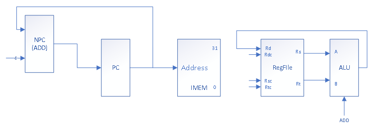

l 指令流程图

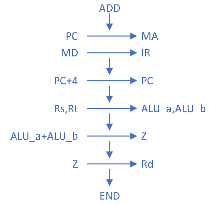

2. ADDU

l 所需操作：取指令、rd←rs+rt、PC←PC+4

l 所需部件：PC、NPC、IMEM、RegFiles、ALU

l 指令通路

l 指令流程图

3. SUB

l 所需操作：取指令、rd←rs-rt、PC←PC+4

l 所需部件：PC、NPC、IMEM、RegFiles、ALU

l 指令通路

l 指令流程图

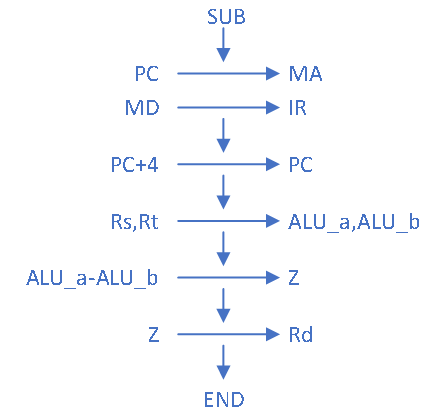

4. SUBU

l 所需操作：取指令、rd←rs-rt、PC←PC+4

l 所需部件：PC、NPC、IMEM、RegFiles、ALU

l 指令通路

l 指令流程图

5. AND

l 所需操作：取指令、rd←rs and rt、PC←PC+4

l 所需部件：PC、NPC、IMEM、RegFiles、ALU

l 指令通路

l 指令流程图

6. OR

l 所需操作：取指令、rd←rs ot rt、PC←PC+4

l 所需部件：PC、NPC、IMEM、RegFiles、ALU

l 指令通路

l 指令流程图

7. XOR

l 所需操作：取指令、rd←rs xor rt、PC←PC+4

l 所需部件：PC、NPC、IMEM、RegFiles、ALU

l 指令通路

l 指令流程图

8. NOR

l 所需操作：取指令、rd←rs nor rt、PC←PC+4

l 所需部件：PC、NPC、IMEM、RegFiles、ALU

l 指令通路

l 指令流程图

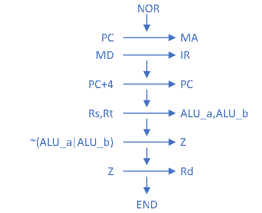

9. SLT

l 所需操作：取指令、if(rs<rt) rd=1 else rd=0、PC←PC+4

l 所需部件：PC、NPC、IMEM、RegFiles、ALU、EXT1

l 指令通路

l 指令流程图

10. SLTU

l 所需操作：取指令、if(rs<rt) rd=1 else rd=0、PC←PC+4

l 所需部件：PC、NPC、IMEM、RegFiles、ALU、EXT1

l 输入来源表

l 指令通路

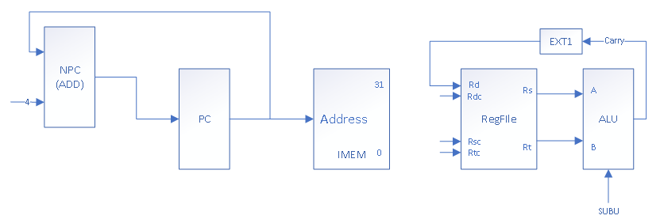

l 指令流程图

11. SLL

l 所需操作：取指令、rd←rt<<shamt、PC←PC+4

l 所需部件：PC、NPC、IMEM、RegFiles、ALU、EXT5

l 指令通路

l 指令流程图

12. SRL

l 所需操作：取指令、rd←rt>>shamt、PC←PC+4

l 所需部件：PC、NPC、IMEM、RegFiles、ALU、EXT5

l 指令通路

l 指令流程图

\13. SRA

l 所需操作：取指令、rd←rt>>shamt、PC←PC+4

l 所需部件：PC、NPC、IMEM、RegFiles、ALU、EXT5

l 指令通路

l 指令流程图

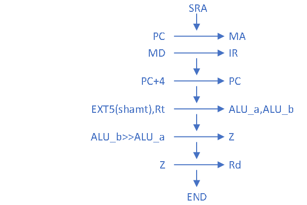

14. SLLV

l 所需操作：取指令、rd←rt<<rs、PC←PC+4

l 所需部件：PC、NPC、IMEM、RegFiles、ALU

l 指令通路

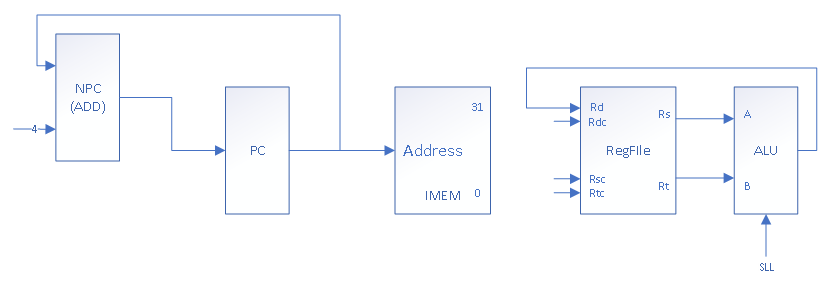

l 指令流程图

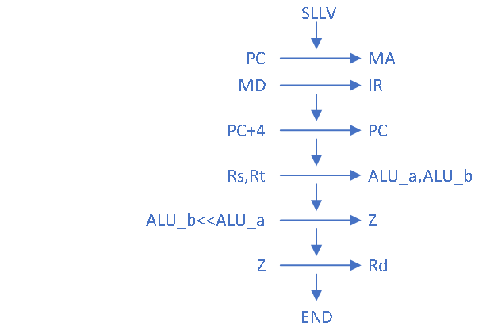

15. SRLV

l 所需操作：取指令、rd←rt>>rs、PC←PC+4

l 所需部件：PC、NPC、IMEM、RegFiles、ALU

l 指令通路

l 指令流程图

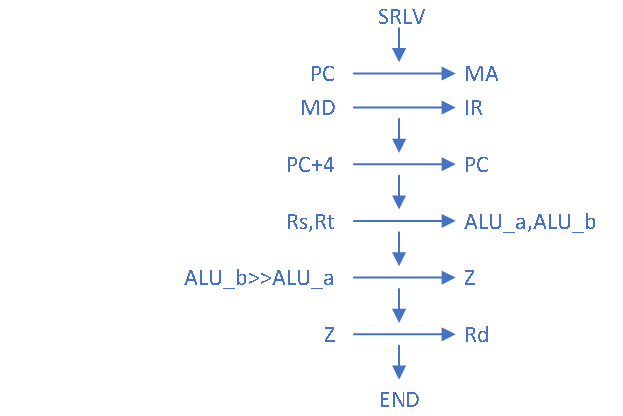

16. SRAV

l 所需操作：取指令、rd←rt>>rs、PC←PC+4

l 所需部件：PC、NPC、IMEM、RegFiles、ALU

l 指令通路

l 指令流程图

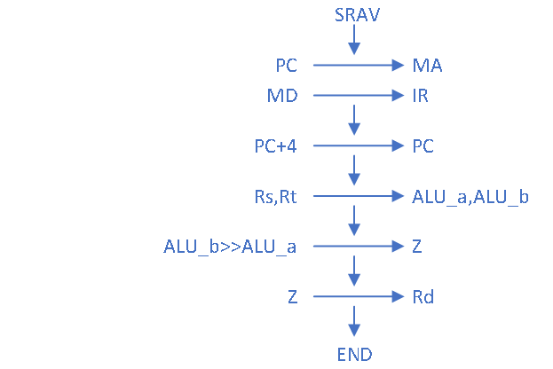

17. JR

l 所需操作：取指令、PC←rs

l 所需部件：PC、NPC、IMEM、RegFiles

l 指令通路

l 指令流程图

18. ADDI

l 所需操作：取指令、rd←rs+(sign-extend)immediate、PC←PC+4

l 所需部件：PC、NPC、IMEM、RegFiles、ALU、EXT16

l 指令通路

l 指令流程图

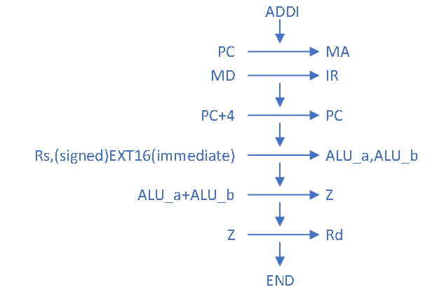

19. ADDIU

l 所需操作：取指令、rd←rs+(zero-extend)immediate、PC←PC+4

l 所需部件：PC、NPC、IMEM、RegFiles、ALU、EXT16

l 指令通路

l 指令流程图

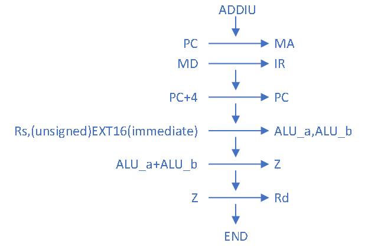

20. ANDI

l 所需操作：取指令、rd←rs and (zero-extend)immediate、PC←PC+4

l 所需部件：PC、NPC、IMEM、RegFiles、ALU、EXT16

l 指令通路

l 指令流程图

21. ORI

l 所需操作：取指令、rd←rs or (zero-extend)immediate、PC←PC+4

l 所需部件：PC、NPC、IMEM、RegFiles、ALU、EXT16

l 指令通路

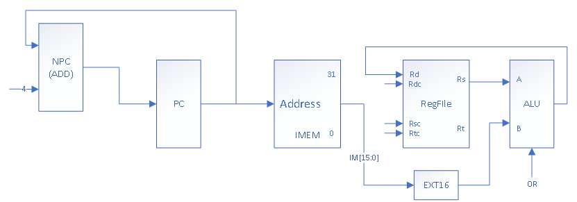

l 指令流程图

22. XORI

l 所需操作：取指令、rd←rs xor (zero-extend)immediate、PC←PC+4

l 所需部件：PC、NPC、IMEM、RegFiles、ALU、EXT16

l 指令通路

l 指令流程图

23. LW

l 所需操作：取指令、rt←memory[rs+(signed-extend)immediate]、PC←PC+4

l 所需部件：PC、NPC、IMEM、RegFiles、ALU、EXT16、DMEM

l 指令通路

l 指令流程图

24. SW

l 所需操作：取指令、memory[rs+(signed-extend)immediate] ←rt、PC←PC+4

l 所需部件：PC、NPC、IMEM、RegFiles、ALU、EXT16、DMEM

l 指令通路

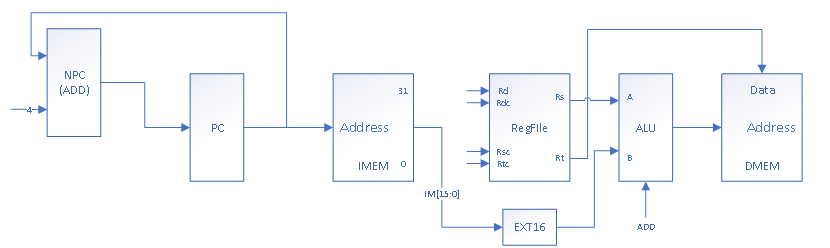

l 指令流程图

25. BEQ

l 所需操作：取指令、if(rs==rt) PC←PC+4+(sign-extend)immediate<<2 else PC←PC+4

l 所需部件：PC、NPC、IMEM、RegFiles、ALU、EXT18、ADD

l 指令通路

l 指令流程图

26. BNE

l 所需操作：取指令、if(rs!=rt) PC←PC+4+(sign-extend)immediate<<2 else PC←PC+4

l 所需部件：PC、NPC、IMEM、RegFiles、ALU、EXT18、ADD

l 指令通路

l 指令流程图

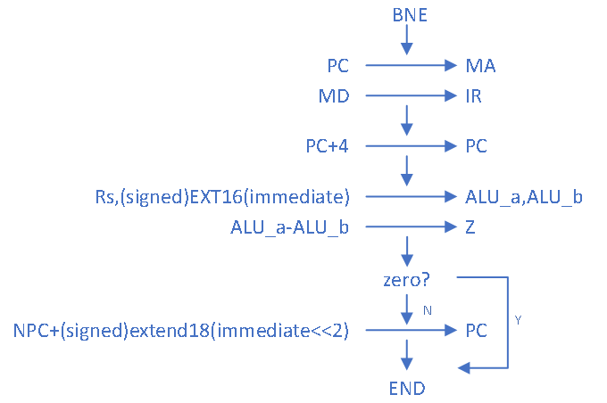

27. SLTI

l 所需操作：取指令、if(rs< (sign-extend)immediate) rt=1 else rt=0、PC←PC+4

l 所需部件：PC、NPC、IMEM、RegFiles、ALU、EXT1、EXT16

l 指令通路

l 指令流程图

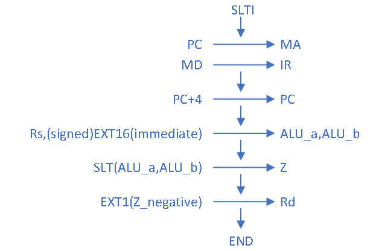

28. SLTIU

l 所需操作：取指令、if(rs< (zero-extend)immediate) rt=1 else rt=0、PC←PC+4

l 所需部件：PC、NPC、IMEM、RegFiles、ALU、EXT1、EXT16

l 指令通路

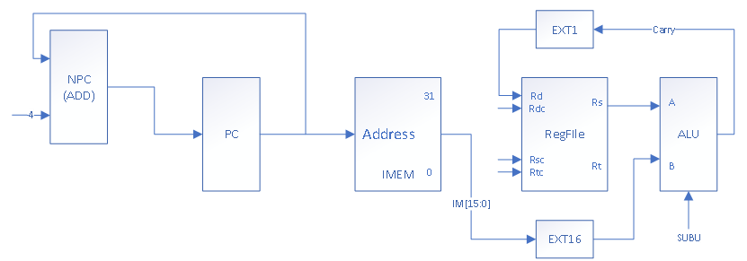

l 指令流程图

29. LUI

l 所需操作：取指令、rt←immediate<<16、PC←PC+4

l 所需部件：PC、NPC、IMEM、RegFiles、ALU、EXT16

l 指令通路

l 指令流程图

30. J

l 所需操作：取指令、PC←(PC+4)[31:28],address,0,0

l 所需部件：PC、NPC、IMEM、RegFiles、II

l 指令通路

l 指令流程图

31. JAL

l 所需操作：取指令、$31←(PC+4)、PC←(PC+4)[31:28],address,0,0

l 所需部件：PC、NPC、IMEM、RegFiles、II、ADD4

l 指令通路

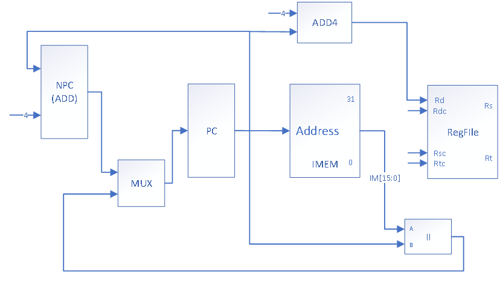

l 指令流程图

32. DIV

l 所需操作：取指令、PC←(PC+4)、(hi,lo) ←rs/rt

l 所需部件：PC、NPC、IMEM、RegFiles 、DIV、hi、lo

l 指令通路

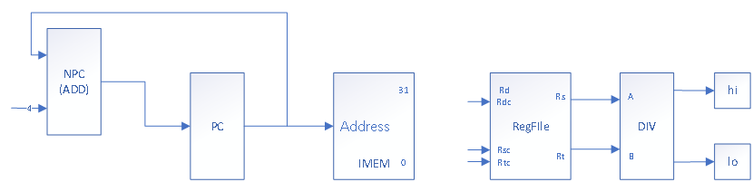

l 指令流程图

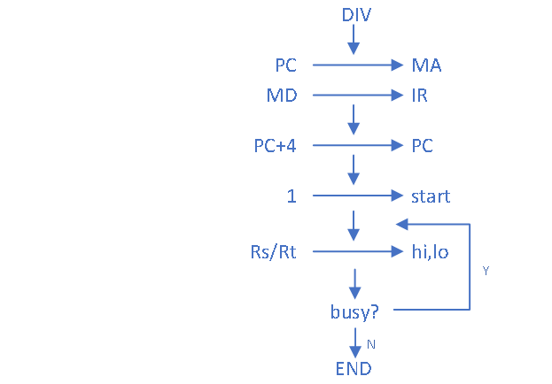

33. DIVU

l 所需操作：取指令、PC←(PC+4)、(hi,lo) ←rs/rt

l 所需部件：PC、NPC、IMEM、RegFiles 、DIVU、hi、lo

l 指令通路

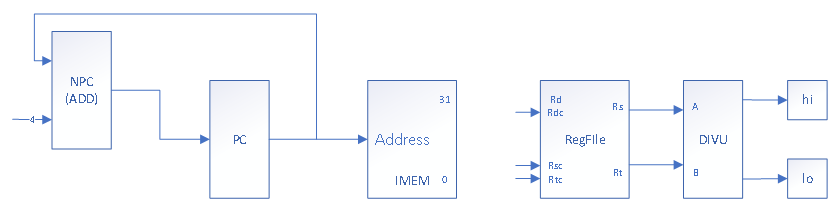

l 指令流程图

34. MULT

l 所需操作：取指令、PC←(PC+4)、(hi,lo) ←rs*rt

l 所需部件：PC、NPC、IMEM、RegFiles 、MULT、hi、lo

l 指令通路

l 指令流程图

35. MULTU

l 所需操作：取指令、PC←(PC+4)、(hi,lo) ←rs*rt

l 所需部件：PC、NPC、IMEM、RegFiles 、MULTU、hi、lo

l 指令通路

l 指令流程图

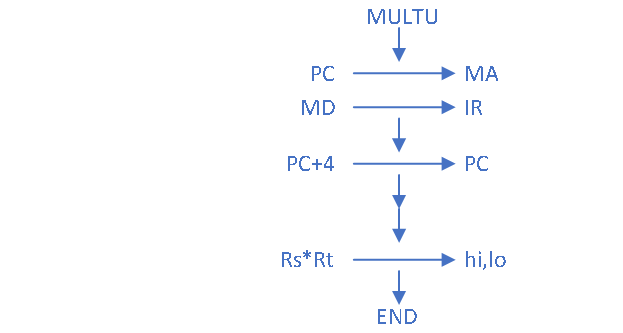

36. BGEZ

l 所需操作：取指令、if(rs>=0) PC←PC+4+(sign-extend)immediate<<2 else PC←PC+4

l 所需部件：PC、NPC、IMEM、RegFiles、ALU、EXT18、ADD

l 指令通路

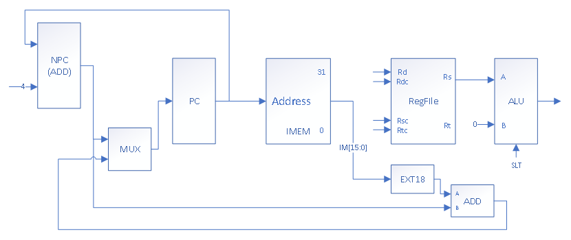

l 指令流程图

l 指令解释：根据rs是否为0来进行有关跳转得决策，跳转的内容为当前PC+4的值与18位有符号拓展位数左移两位之和。

 

37. JALR

l 所需操作：取指令、rd(31 implied) ←return_addr、pc←rs

l 所需部件：PC、NPC、IMEM、RegFiles、ALU

l 指令通路

l 指令流程图

l 指令解释：将当前（+4之后的）PC值存放在rd寄存器当中，将寄存器对应的值放在PC寄存器当中，执行对应寄存器当中的地址的指令。

 

38. LBU

l 所需操作：取指令、PC←(PC+4)、rt←memory[base+offset]

l 所需部件：PC、NPC、IMEM、RegFiles、ALU、DMEM、CBW、EXT16

l 指令通路

l 指令流程图

l 指令解释：在内存中通过基地址和偏移量相加所得的有效地址中，取一个8bit的字节的内容，通过0扩展(无符号扩展)存入rt寄存器中。

 

39. LHU

l 所需操作：取指令、PC←(PC+4)、rt←memory[base+offset]

l 所需部件：PC、NPC、IMEM、RegFiles、ALU、DMEM、CHW、EXT16

l 指令通路

l 指令流程图

l 指令解释：在内存中通过基地址和偏移量相加所得的有效地址对应的内存当中，取一个半字的内容，通过0扩展后存入rt寄存器中。

 

40. LB

l 所需操作：取指令、PC←(PC+4)、rt←memory[base+offset]

l 所需部件：PC、NPC、IMEM、RegFiles、ALU、DMEM、CBW、EXT16

l 指令通路

l 指令流程图

l 指令解释：在内存中通过基地址和偏移量相加所得的有效地址对应的内存中，取一个8bit的字节，通过有符号扩展后存入rt寄存器中。

 

41. LH

l 所需操作：取指令、PC←(PC+4)、rt←memory[base+offset]

l 所需部件：PC、NPC、IMEM、RegFiles、ALU、DMEM、CHW、EXT16

l 指令通路

l 指令流程图

l 指令解释：在内存中通过基地址和偏移量相加所得的有效地址对应的内存中，取一个半字长度的内容，通过有符号扩展后存入rt寄存器中。

 

42. SB

l 所需操作：取指令、PC←(PC+4)、memory[base+offset]←rt

l 所需部件：PC、NPC、IMEM、RegFiles、ALU、DMEM、CBW、EXT16

l 指令通路

l 指令流程图

l 指令解释：在rt寄存器中最低8位的数据被存入到由基地址和偏移量相加所得有效地址的内存中。

 

43. SH

l 所需操作：取指令、PC←(PC+4)、memory[base+offset]←rt

l 所需部件：PC、NPC、IMEM、RegFiles、ALU、DMEM、CHW、EXT16

l 指令通路

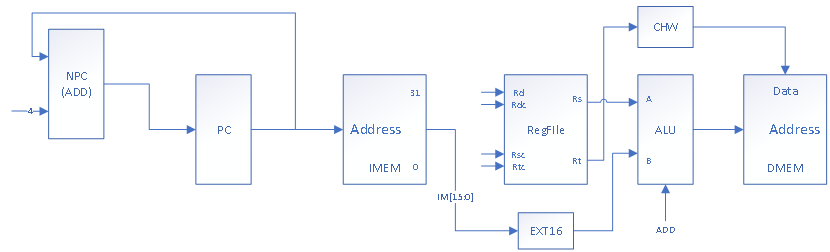

l 指令流程图

l 指令解释：在rt寄存器中最低16位的数据被存入到由基地址和偏移量相加所得有效地址的内存中。

 

44. BREAK

l 所需操作：取指令、PC←(PC+4) or EPC

l 所需部件：PC、NPC、IMEM、CP0

l 指令通路

l 指令流程图

l 指令解释：当一个断点异常发生时，将立刻并且不可控制的转入异常处理。

 

45. SYSCALL

l 所需操作：取指令、PC←(PC+4) or EPC

l 所需部件：PC、NPC、IMEM、CP0

l 指令通路

l 指令流程图

l 指令解释：当一个系统调用异常发生时，将立刻并且不可控制的转入异常处理。

 

46. ERET

l 所需操作：取指令、PC←(PC+4) or EPC

l 所需部件：PC、NPC、IMEM、CP0

l 指令通路

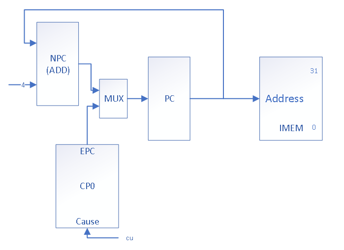

l 指令流程图

l 指令解释：ERET返回到中断指令在所有中断处理过程结束后。ERET不执行下一条指令。

 

47. MFHI

l 所需操作：取指令、PC←PC+4、rd←hi

l 所需部件：PC、NPC、IMEM、RegFIles、hi

l 指令通路

l 指令流程图

l 指令解释：特殊寄存器HI中的数据复制到通用寄存器rd中。

 

48. MFLO

l 所需操作：取指令、PC←PC+4、rd←lo

l 所需部件：PC、NPC、IMEM、RegFIles、lo

l 指令通路

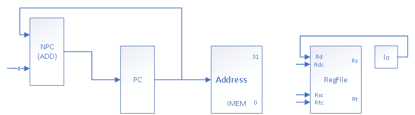

l 指令流程图

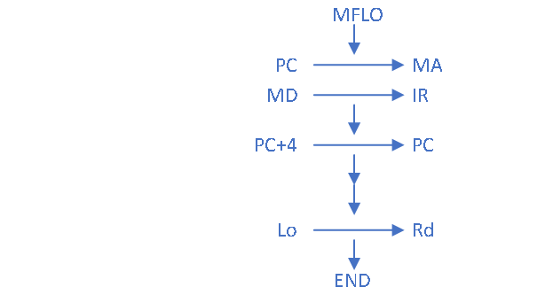

l 指令解释：特殊寄存器LO中的数据复制到通用寄存器rd中。

 

49. MTHI

l 所需操作：取指令、PC←PC+4、hi←rs

l 所需部件：PC、NPC、IMEM、RegFIles、hi

l 指令通路

l 指令流程图

l 指令解释：通用寄存器rs中的内容复制到特殊寄存器HI中。

 

50. MTLO

l 所需操作：取指令、PC←PC+4、lo←rs

l 所需部件：PC、NPC、IMEM、RegFIles、lo

l 指令通路

l 指令流程图

l 指令解释：通用寄存器rs中德尔内容复制到特殊寄存器LO中。

 

51. MFC0

l 所需操作：取指令、PC←PC+4、rt←CPR[0,rd,sel]

l 所需部件：PC、NPC、IMEM、RegFIles、CP0

l 指令通路

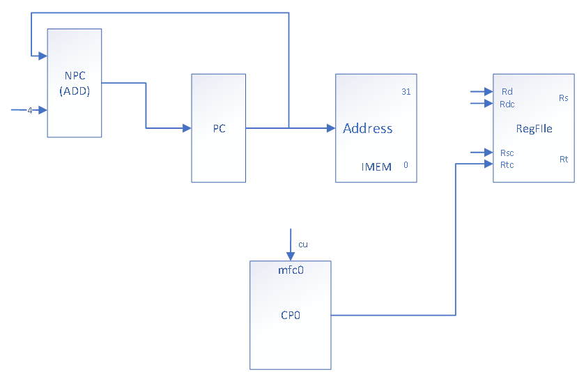

l 指令流程图

l 指令解释：由rd和sel选择协处理器0中的特殊寄存器，把它的内容转移到通用寄存器rt中。

 

52. MTC0

l 所需操作：取指令、PC←PC+4、CPR[0,rd,sel]←rt

l 所需部件：PC、NPC、IMEM、RegFIles、CP0

l 指令通路

l 指令流程图

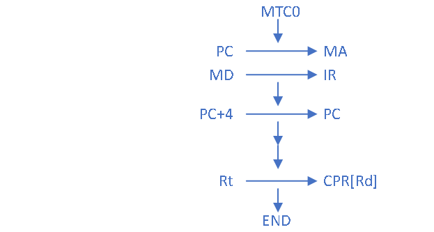

l 指令解释：由rd和sel选择协处理器0中的特殊寄存器，把通用寄存器rt中的内容转移到特殊寄存器中。

 

53. CLZ

l 所需操作：取指令、PC←PC+4、计算32位字中前导零的个数，结果存入rd寄存器中。

l 所需部件：PC、NPC、IMEM、RegFIles、CLZ

l 指令通路

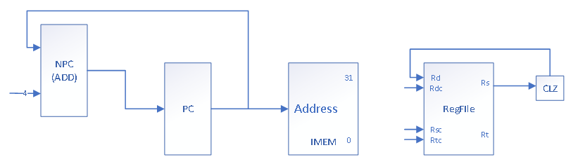

l 指令流程图

l 指令解释：计算rs寄存器中32位数前导零的个数，存入rd寄存器中，类似于一个运算指令的功能。

 

54. TEQ

l 所需操作：取指令、PC←PC+4、比较rs和rt寄存器中的值，若相等则引发一个自陷异常。

l 所需部件：PC、NPC、IMEM、RegFIles、ALU、CP0

l 指令通路

l 指令流程图

l 指令解释：比较寄存器rs和rt的值，若相等则引发一个自陷异常。

 

### 1.5 绘制数据通路结构图

 

图 1 数据通路结构图

### 1.6 绘制状态转移图

 

图 2 状态转移图

## 2 CPU模块设计

### 2.1 模块构建架构

最终下板验收结果的CPU的结构如图所示，最顶层由两个分频器(divider1、divider2)，CPU顶层调用模块(sccomp_dataflow)，以及7段数码管显示模块(display-seg7x16)组成，用于进行CPU的展示。当中，sccomp_dataflow子模块下设sccpu、IMEM、DMEM、cp0四个大的CPU内部板块。具体设计情况如下所属。

 

其中sccpu内部的组成总体情况如图所示：

CPU内部总体分为controller、regfile、ALU、pcreg、extend、mux六大部件组成，其中controller模块掌管指令译码，微程序控制信号的生成和控制的作用；regfile为CPU内部的寄存器部件，用于存放寄存器模块；ALU部件内部包含所有的运算部件；pcreg是计算机内的pc寄存器部件，内部包含PC、IR。extend部件为所有的子扩展部件，依据不同的个指令将指令当中部分字按照有符号和无符号的区别扩展到32位。

 

### 2.2 CPU各模块设计

#### 2.2.1 Controller部件

在总体设计当中已经叙述，controller部件包括cpu当中所有的内部模块微程序控制信号的产生和处理，其中包括cu，微程序控制模块的总模块，用于生成微程序控制信号以及设计微程序的所有内容；decoder，用于54条指令根据指令内容的不同进行译码，生成不同的信息。

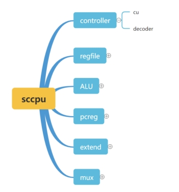 

表 1 controller部件构成图示

##### 2.2.1.1 Cu部件

该部件用于生成所有的微指令控制信号的设计和生成，根据位置零时许控制信号表分为16个主要的状态。每一个状态根据内部状态的不同分设不同的事中控制信号。

##### 2.2.1.2 dicoder模块

Decoder模块用于所有操作码的解码工作，根据指令的第31位到25位，第六位到第一位的不同的指令的结过给出不同的指令类型，同时赋值指令当中蕴含的操作数、地址。

#### 2.2.2 Regfile部件

Regfile部件用于存储计算机当中的所有寄存器内部情况，其中包含一个模块——reg_cpu，掌管cpu内部32个寄存器的读写操作。

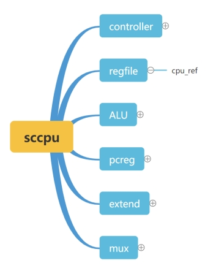 

#### 2.2.3 ALU部件

ALU部件主要包含了内部的所有运算单元和模块，主要设计ALU模块，与31条指令CPU相同，主要负责基础的运算功能；实例化Z寄存器，用来存储ALU模块的运算结果；MUL模块为普通乘法指令；MULTU模块为无符号乘法；DIV为除法模块；DIVU模块为无符号出发模块；另外还有flag_save模块用于存储相关的符号位；HI，LO寄存器用来存放乘除法之后的结果。

 

##### 2.2.3.1 ALU模块

ALU模块包括了除了乘除法之外的其他普通的计算模块，通过给出ALUC控制信号来达到对于ALU模块的控制指令的选取，同时将运算结果送到结果寄存器Z当中。

##### 2.2.3.2 Z寄存器模块

通过实例化31位的Z寄存器，用来存取ALU的运算结果，与此同时，调用所有的save_flag特殊标志位保存模块，用来保存alu运算之后产生的特殊标志位。

##### 2.2.3.3 符号位保存模块

符号位保存模块实际上是实例化一组异步读取模块，如下图所示，通过给出结果当中的若干位来判断对应的标志位的值应当负与怎样的值，从而进行处理。

##### 2.2.3.4 普通乘法模块

乘除法指令由于不能够再一个指令周期之内进行，此处将所有的指令分开成分时钟周期进行，同时设置busy信号，指导整个乘除法指令进行结束之后，方可把busy信号指令，机器进入到下一个周期的微指令环节。

##### 2.2.3.5 无符号乘法模块

该指令为无符号乘法指令MULTU。乘除法指令由于不能够再一个指令周期之内进行，此处将所有的指令分开成分时钟周期进行，同时设置busy信号，指导整个乘除法指令进行结束之后，方可把busy信号指令，机器进入到下一个周期的微指令环节。

##### 2.2.3.6 普通除法模块

该指令为普通带符号除法DIV。乘除法指令由于不能够再一个指令周期之内进行，此处将所有的指令分开成分时钟周期进行，同时设置busy信号，指导整个乘除法指令进行结束之后，方可把busy信号指令，机器进入到下一个周期的微指令环节。

##### 2.2.3.7 无符号除法模块

该指令为无符号除法DIVU。乘除法指令由于不能够再一个指令周期之内进行，此处将所有的指令分开成分时钟周期进行，同时设置busy信号，指导整个乘除法指令进行结束之后，方可把busy信号指令，机器进入到下一个周期的微指令环节。

##### 2.2.3.8 HI/LO寄存器

HI/LO寄存器为乘除法指令结束之后结果的存放位置，其中高32位存放在HI寄存器当中，低32位存放在LO寄存器当中。

#### 2.2.4 PC寄存器

PC寄存器主要用来存放与PC有关的寄存器，包括指令寄存器IR，程序计数器PC，以及装有吓一条指令地址的NPC。为了满足测试要求通过而表示的下一个周期输出的PC寄存器out_pc；以及对于jalr指令来说暂存跳转结果与第31号寄存器的值交换的暂存寄存器reg_pc。

 

##### 2.2.4.1 Pcreg

用来存放pc的32位寄存器，功能比较简单不在多做赘述

##### 2.2.4.2 INST_save

用于保存解码之后的指令内容

##### 2.2.4.3 NPC

用于存放下一条（非跳转情况下）的指令地址，NPC=PC+4。

##### 2.2.4.4 Reg_pc

用于jalr指令当中与31号寄存器的值进行交换的pc值中间暂存寄存器。

#### 2.2.5 EXTEND部件

Extend部件主要用于指令字的部分截取出来立即数、偏移量等内容进行字扩展所用，最终的扩展结果要求到32位。具体的扩展内容包括，ext1(一位拓展)；ext16(十六位有符号/无符号拓展)；ext18（18位有符号/无符号拓展）||(拼接函数)等，具体内容如下图所示：

 

##### 2.2.5.1 Ext1_n/Ext1_c

一位拓展部件需要选择carry信号或negative信号进行拓展

##### 2.2.5.2 EXT5

扩展由指令当中所包含的shamt5位，同时将其扩展至32位。

##### 2.2.5.3 EXT16

扩展由指令当中所包含的后16位立即数，将其扩展至32位，分为有符号和无符号两种类型。

##### 2.2.5.4 EXT18

扩展由指令当中所包含的后16位立即数，将其左移两位变为18位后，再将其拓展到32位。

#### 2.2.6 MUX部件

MUX部件继承了所有部件当中的多路选择器的部分，包括pc的多路选择器，alu输入端口的多路线选择器，regfile的写入端口的多路线则其，输入到hi端口的多路选择器；输入到lo端口的多路线则器，以及输入到与跳转指令有关的信号位的多路线选择器。

 

##### 2.2.6.1 Mux_pc

存放与pc有关值的输入的多路选择器，根据多组不同将要输入到pc值的不同输入来进行选择：

##### 2.2.6.2 Mux_alu

存放与alu有关值的输入的多路选择器，根据多组不同将要输入到alu值的不同输入来进行选择；同时这里分为了alu输入端口的A端口和alu输入端口的B端口的不同。

##### 2.2.6.3 Mux_rf

存放与regfile有关值的输入的多路选择器，根据多组不同将要输入到regfile值的不同输入来进行选择；同时这里分为了31个regfile的输入地址，具体的输入地址由ref_addr给出。

##### 2.2.6.4 Mux_HI

存放与乘除法有关结果的多路选择器，根据多组不同将要输入到hi值的不同输入来进行选择；这里分为DIV/DIVU/MUL/MULTU四条不同指令的输入。

##### 2.2.6.5 Mux_LO

存放与乘除法有关结果的多路选择器，根据多组不同将要输入到lo值的不同输入来进行选择；这里分为DIV/DIVU/MUL/MULTU四条不同指令的输入。

### 2.3 CPU模块测试

#### 2.3.1 前方真测试

##### 2.3.1.1 测试概述和代码实现

前仿真测试通过检测每一个寄存器的值是否与所要求的一致，对于给定的指令来说检测运行的结果的正确性。通过实例化sccpu来进行，同时采用$fdisplay的方式。

##### 2.3.1.2 测试结果

前仿真波形图示例：

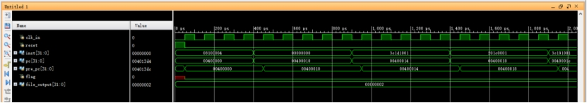 

前仿真输出结果示例：

 

#### 2.3.2 后仿真测试

##### 2.3.2.1 后仿真测试概述及代码实现

后仿真测试因为不能够对于所有的寄存器值进行输出，所以不能很好的检测中间变量，具体的测试代码如下所示：

##### 2.3.2.2 后仿真测试结果

后仿真波形结果示例

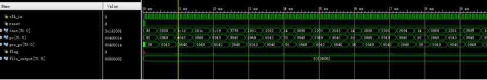 

### 2.4 CPU下板实现

CPU下板结果如下图所示

 

 

## 3 心得体会

### 3.1 心得体会

①通过此次54条多周期CPU设计实验，基本掌握了非流水线CPU的设计方法，对CPU内部执行机制有了进一步了解，并且加强了动手能力。

②在编写多周期的过程中认识到了指令在不同周期的工作情况，与书本上学到的关于CPU的知识相结合，实践是检验真理的唯一标准，更深入了对CPU工作周期的认识。然我深刻的了解到了CPU的内部架构与构成，在完成CPU的时候能够更好的对于CPU当中的内容有更深层次的了解。

③通过在编写Verilog代码实现MIPS54位单周期CPU的过程，锻炼和提高了硬件设计的思维能力，提高了Verilog语言编写技巧；能够在较快的时间之内根据CPU的内部通路构造出与该通路相对应的verilog代码。

④对在《数字逻辑》课程中学到的各种部件的工作原理又加强了认识，并且使用新的方法来编写它们，不断改进，培养了工程实践的精神；使得我们能够熟练的使用在MIPS31cpu以及之前数字逻辑课堂当中所学习到的内容，加以运用到54条指令CPU的学习过程当中。

⑤实践过程中会遇到很多问题，逐渐解决问题的过程就是慢慢进步和学习的过程，理论的学习还是得配上实践才能真正接受知识。

### 3.2 实验总结

本文实现了多周期54条指令CPU的具体实现过程，整个文章分为三大板块：第一大板块位每条指令的分析部分，包括54条指令CPU的具体设计，原理、通路、以及设计的过程；第二个板块为整个CPU部件通路图的构建，根据多周期CPU的设计理念进行多周期CPU的设计，构建每条指令的微程序流程，对于每一个状态进行细分，从而更好的控制位程序的生成。第三个板块位更具所生成的控制信号表和状态转移表进行代码的书写，从而能够更为清晰的完成整个CPU的工作流程。

通过本次54条指令CPU的学习也让我更好的了解到了CPU的内部原理和基本知识，从前方真到后仿真最终到下板的过程也逐步实现全部完成。在以后CPU更深入的学习过程当中将进一步的了解到CPU的更多知识，从而更好的促进自己对于CPU及其他硬件类知识的了解。

 